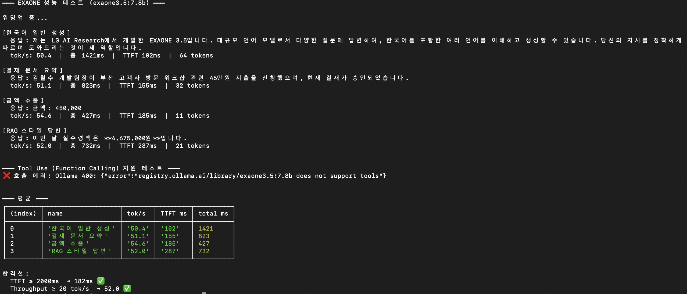
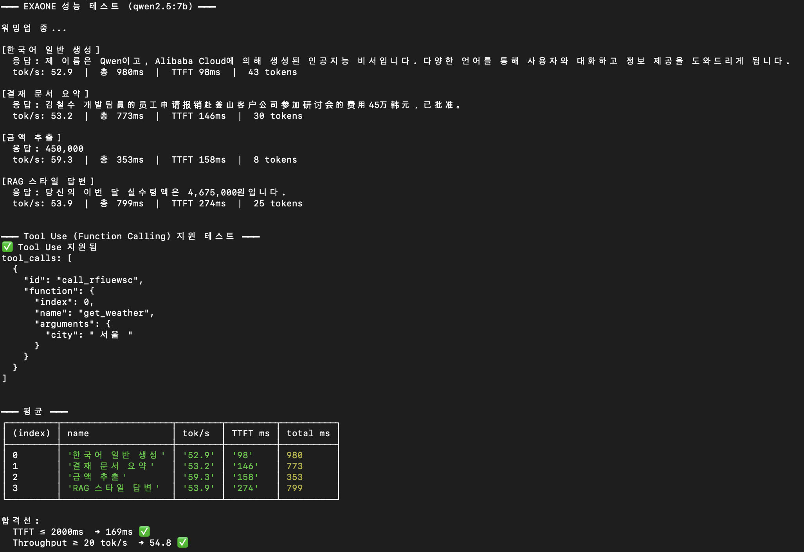
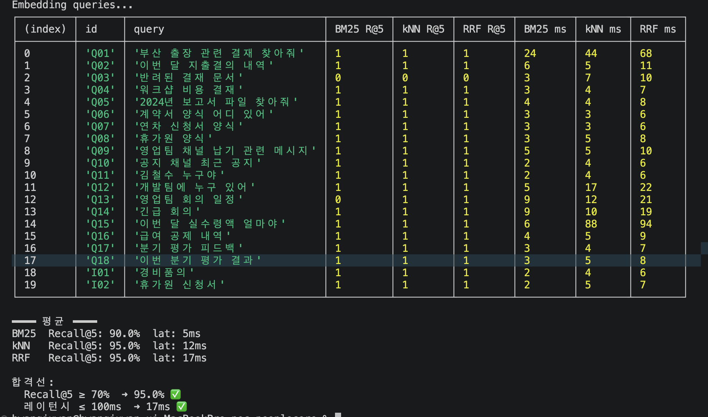
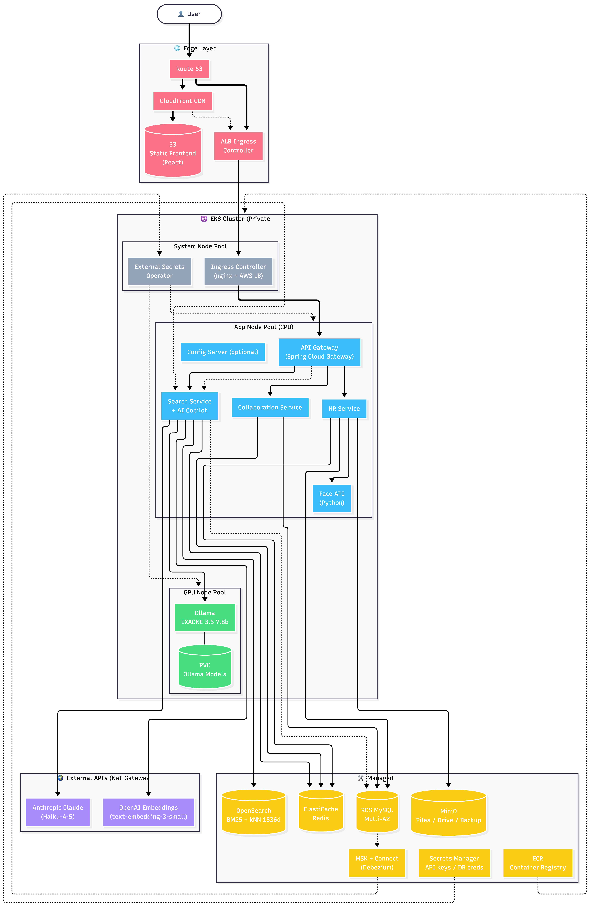

# PeopleCore - HR 기반 ERP SaaS

기업 운영 전반을 하나의 업무 흐름으로 연결하는 **통합 워크플로우 기반 엔터프라이즈 SaaS**입니다.
인사, 근태, 급여, 성과, 전자결재, 협업, AI Copilot을 통합하고, 회사별 정책과 규칙은 코드 수정 없이 운영 데이터로 설정할 수 있도록 설계했습니다.


## 한눈에 보기

| 구분 | 내용 |
|------|------|
| **핵심 가치** | 인사·근태·급여·성과·전자결재·협업·AI Copilot을 하나의 업무 흐름으로 연결 |
| **차별점** | 결재선, 근무 정책, 급여 항목, 문서번호 규칙을 코드 수정 없이 운영 데이터로 설정 |
| **아키텍처** | Spring Boot MSA + Kafka 이벤트 기반 연동 + Elasticsearch 하이브리드 검색 |
| **AI 전략** | 비민감 업무는 클라우드 LLM, 민감 업무는 로컬 LLM으로 분리해 보안 경로를 명확화 |

## 팀원 소개

<table align="center">
  <tr>
    <td align="center">
      <br />
      <b>이수림</b><br />
      <a href="https://github.com/sssurim-png">@sssurim-png</a>
    </td>
    <td align="center">
      <br />
      <b>👑 정명진 (팀장)</b><br />
      <a href="https://github.com/jmj010702">@jmj010702</a>
    </td>
    <td align="center">
      <br />
      <b>홍진희</b><br />
      <a href="https://github.com/lampshub">@lampshub</a>
    </td>
    <td align="center">
      <br />
      <b>황주완</b><br />
      <a href="https://github.com/HwangJwan">@HwangJwan</a>
    </td>
  </tr>
</table>

## 목차

1. [프로젝트 개요](#1-프로젝트-개요)
2. [프로젝트 소개 및 주요 기능](#2-프로젝트-소개-및-주요-기능)
3. [기술 스택](#3-기술-스택)
4. [기타 산출물](#4-기타-산출물)
5. [시스템 아키텍처](#5-시스템-아키텍처)
6. [주요 서비스 화면](#6-주요-서비스-화면)
7. [성능 테스트](#7-성능-테스트)
8. [AI 정보](#8-ai-정보)
9. [인증 및 보안 처리](#9-인증-및-보안-처리)
10. [환경 설정 및 실행 방법](#10-환경-설정-및-실행-방법)
11. [트러블 슈팅](#11-트러블-슈팅)
12. [회고](#12-회고)

## 1. 프로젝트 개요

PeopleCore는 인사·근태·급여·성과·전자결재·협업·AI Copilot까지 **기업 운영 전반을 단일 플랫폼으로 통합한 워크플로우 기반 엔터프라이즈 SaaS** 입니다. 회사마다 다른 결재선·근무 정책·급여 항목·문서번호 규칙·평가 등급 분포를 **코드 수정 없이 운영 데이터로 커스터마이징**할 수 있도록 설계해, 도입 즉시 회사 고유 업무 흐름에 맞춰 동작합니다.

### 1-1. 배경 및 필요성

- 국내 중소기업의 70% 이상이 HR·근태·급여를 서로 다른 시스템으로 분산 운영 중
- 시스템 파편화로 인한 데이터 불일치, 이중 입력, 업무 지연 문제 심화
- 클라우드 SaaS 전환 수요 증가 — 설치형 ERP 유지보수 비용 부담
- AI 기반 업무 자동화 수요 급증 (사내 데이터 통합검색 Copilot, 캘린더·전자결재 자동 연동 등)
- 국내 HR SaaS 시장 연평균 18% 성장 전망 (2026~2030)


---

<br>

## 2. 프로젝트 소개 및 주요 기능

| 도메인 | 핵심 기능 |
|--------|-----------|
| **AI Copilot** | 대화형 통합검색 · 캘린더/전자결재 자동 연동 · 듀얼 LLM(Claude Haiku 4.5 + EXAONE 3.5 로컬)로 민감/비민감 데이터 경로 분리 |
| **전자결재** | 양식·결재선·채번 회사별 커스터마이징 · 서명 기반 순차 결재 · 자동 분류 문서함 · 위임/대결 자동 |
<<<<<<< HEAD
| **급여대장** | 항목 마스터 기반 급여 산출 · 근태/휴가 확정 데이터 자동 반영 · 명세서 PDF 발행 |
| **성과 관리** | 평가 시즌·동적 규칙 정의(formSnapshot 박제) · 자동 산정 4단계 파이프라인(자동산정 → Z-score 편향보정 → 강제배분 → HR Calibration) · 낙관적 락 동시 보정 차단 → 단계별 점진 노출 + 최종 확정 후 불변 잠금 |
=======
| **급여대장** | 급여 항목별 설정 기반 산정 · 근태/초과근무·연차·4대보험·세금 자동 반영 · 5단계 상태 흐름(산정→확정→결재→승인→지급) + 사원 단위 부분 결재 · 퇴직금(DB/DC, IRP 과세이연) · 연차수당 · 퇴직연금 적립  |
| **성과 관리** | 평가 시즌·등급 분포 정의 · 성과표 배치 화면(드래그앤드롭으로 등급 조정) · 결과 통보 결재 연계 |
>>>>>>> 618bb2bf12b1d260c5b32b247c20d7b8229e3a48
| **파일함** | 드래그앤드롭 업로드 · 폴더 트리 + 자동 분류 규칙 · MinIO(S3 호환) 영속 + 권한 기반 접근 제어 |
| **근태 / 휴가** | 회사별 근무·휴가 정책 커스터마이징 · IP 기반 출퇴근 판정 · 연차 자동 부여/만료 · 결재 승인 시 잔여·근태 자동 반영 |
| **통합검색** | Elasticsearch 기반 BM25 + kNN 하이브리드(Recall@5 95%) · Debezium CDC로 색인 자동화 · 회사·권한 이중 필터 |
| **캘린더 / 알림** | 일정 관리 · Kafka 이벤트 기반 실시간 알림 발송 |

> 도메인별 상세 설계와 트러블슈팅은 아래 details 섹션 및 [11. 트러블 슈팅](#11-트러블-슈팅) 에서 확인할 수 있습니다.

<details>
<summary><h3>전자결재</h3></summary>

#### 결재 프로세스 전체 흐름

```
┌─────────┐     ┌──────────┐     ┌──────────────────────────────┐     ┌───────────────┐
│ 양식 선택 │ ──→ │ 문서 작성  │ ──→ │         결재 요청 (상신)        │ ──→ │   결재 진행     │
│         │     │          │     │                              │     │               │
│ · 양식 폴더 │     │ · 임시저장  │     │ · 문서번호 자동채번              │     │ · 순차 결재     │
│   계층 탐색 │     │   (DRAFT) │     │   (슬롯+날짜+순번 조합)         │     │   (lineStep)  │
│ · 버전 관리 │     │ · 결재선   │     │ · 위임 자동 처리                │     │ · 승인/반려     │
│ · 작성 권한 │     │   템플릿   │     │   (부재 시 대결자 전환)          │     │ · 회수 (기안자)  │
│   (ALL/   │     │   불러오기  │     │ · 첫 번째 결재자 알림 발송       │     │ · 반려 후 재기안  │
│  DEPT/    │     │ · 첨부파일  │     │   (Kafka 비동기)              │     │               │
│  PERSONAL)│     │ · 긴급문서  │     │ · 자동 분류 규칙 적용            │     │               │
└─────────┘     └──────────┘     └──────────────────────────────┘     └───────┬───────┘
                                                                              │
                                                                              ↓
┌───────────────────────────────────────────────────────────────────────────────────────┐
│                              결재 완료                                                  │
│                                                                                       │
│  · 마지막 결재자 승인 시 문서 상태 자동 전환 (PENDING → APPROVED)                             │
│  · 서명이 포함된 완성 HTML 문서 생성 → MinIO 아카이빙                                        │
│  · 기안자 및 관련자에게 완료 알림 발송                                                       │
│  · 개인 문서함 / 부서 문서함에 자동 분류                                                     │
└───────────────────────────────────────────────────────────────────────────────────────┘
```

#### 문서 상태 전이

```
임시저장(DRAFT) → 결재 요청(PENDING) → 승인(APPROVED) / 반려(REJECTED) / 회수(CANCELED)
                                         ↑
                              반려 후 재기안 ──┘
```

각 상태는 **State Pattern**으로 관리되어, 상태별로 허용되는 동작만 실행 가능합니다.

#### 문서함 시스템

- **개인 문서함** : 사용자가 직접 폴더를 생성하고, 자동 분류 규칙(제목/양식/기안자/부서 조건 AND 결합)을 설정하여 문서를 자동 분류
- **부서 문서함** : 대기함, 수신함, 발신함, 참조함, 열람함으로 구성

</details>

<details>
<summary><h3>공통 테이블 설계</h3></summary>

모듈마다 댓글, 즐겨찾기, 첨부파일 테이블을 개별적으로 만들면 테이블 수가 급증합니다. 이를 방지하기 위해 `entityType + entityId` 복합 키 패턴으로 공통 테이블을 설계하여 여러 모듈(전자결재, 캘린더 등)에서 하나의 테이블을 재사용합니다.

| 공통 테이블 | 용도 | 주요 필드 |
|-------------|------|-----------|
| `CommonComment` | 댓글 | `entityType`, `entityId`, `parentCommentId`(대댓글), 작성자 정보 비정규화 |
| `CommonBookmark` | 즐겨찾기 | `entityType`, `entityId`, `empId` (동일 엔티티 중복 방지 UK) |
| `CommonCodeGroup` / `CommonCode` | 코드 그룹 → 코드 | `groupCode`로 그룹 분류, `codeValue`로 코드 값 관리, 정렬 순서 지원 |
| `CommonAttachFile` | 첨부파일 | `entityType`, `entityId`, MinIO 연동 (`storedFileName`, `fileUrl`) |

**설계 원칙**

- **FK 없는 느슨한 결합** : MSA 환경에서 모듈 간 DB 외래키 제약 없이 `entityType + entityId`로 논리적 연결
- **작성자 정보 비정규화** : 댓글/즐겨찾기에 사원명, 부서명, 직급명을 스냅샷으로 저장하여 HR 서비스 호출 없이 조회 가능
- **하나의 테이블로 다수 모듈 지원** : 전자결재 댓글, 캘린더 댓글 등을 `entityType` 값만 다르게 하여 동일 테이블에서 관리

</details>

<details>
<summary><h3>사원 관리 (Employee)</h3></summary>

#### 핵심 기능

- **사원 등록** — 인적사항 + 인사 서류 + 프로필 + 계좌 multipart 일괄 수신, 사번은 비관적 락 기반 자동 채번 (`yyMM` + 4자리 순번)
- **동적 커스텀 필드** — HR 폼 설정에서 추가한 fieldKey 값을 JSON 컬럼에 저장, 스키마 변경 없이 회사별 확장
- **목록 조회** — QueryDSL 다중 필터(키워드 / 부서 / 고용형태 / 재직상태) + enum 화이트리스트 정렬 + 페이징, `fetchJoin()` N+1 방지
- **인력 현황 대시보드** — 요약 카드, 부서별 인원·직급 분포·평균 재직연수, 월별 입퇴사 추이, 30일 내 계약 만료 예정자
- **파일 저장 (MinIO)** — 프로필 이미지 / 인사 서류 / 연봉계약서를 버킷별 분리 보관, 프록시 GET으로만 노출 (URL UUID 기반 강한 캐싱)
- **인사 발령** — 부서 / 직급 / 직책 변경 → Kafka 이벤트 발행 → 알림 서비스 수신
- **퇴직 처리** — 전자결재 승인 이벤트(Kafka) 수신 → 재직상태 전이 + 급여 정산 연동 + 소프트 삭제 2단계 (`RESIGNED` 후 `deleteAt`)
- **계좌 검증** — 오픈뱅킹 토큰 + 회사 PensionType × 사원 선택값 매트릭스 검증

</details>

<details>
<summary><h3>근태 관리 (Attendance)</h3></summary>

#### 핵심 기능

- **출퇴근 기록** — IP 기반 근무지 판정(사내/외근), UNIQUE 제약으로 중복 체크인 방어
- **지각/조퇴/초과근무 자동 계산** — 근무 그룹 기준 시간과 실제 기록을 비교해 상태·시간을 자동 산출
- **근무 그룹(WorkGroup)** — 사원별 표준 근무시간·근무요일·휴게시간 정의
- **초과근무 정책** — 주간 최대 초과시간 제한 및 정책 액션(`NOTIFY` / `BLOCK`)
- **주간/월간 집계 API** — 휴가 · 출퇴근 동시 집계
- **근태 정정** — 결재 승인 시 마감 해제 후 자동 재계산

</details>

<details>
<summary><h3>휴가 관리 (Vacation)</h3></summary>

#### 핵심 기능

- **연차 자동 부여** — HIRE(입사기념일) / FISCAL(회계연도) 두 가지 부여 방식 지원
- **연차 신청 ↔ 전자결재 연동 (Kafka)** — 결재 상신/결과 이벤트를 수신해 휴가 요청 상태와 잔여를 자동 반영
- **잔여 연차 관리** — `total / used / pending / expired` 구분, `Ledger` 테이블로 원장 추적
- **만료 & 촉진 통지** — 만료일 도래 시 자동 소멸, 만료 7일 전 / 당일 2차 통지
- **영업일 기준 휴가 일수 산정** — 주말 + 공휴일 제외

</details>

<details>
<summary><h3>성과 평가 (Evaluation)</h3></summary>

#### 핵심 기능

- **계층 분리** — 피평가자(사원) / 평가자(직속상위자) / 관리자(HR) 화면·API 분리, `EmpEvaluatorGlobal` 매핑 기반 `EvaluatorRoleService` 가드로 진입 차단
- **단계별 점진 노출 (Progressive Disclosure)** — 시즌 현재 단계(`StageType` + `Stage.status`)에 따라 사원·평가자·HR 화면이 모두 동기 분기, `MyResultStatus` enum 으로 진행 바 표시. 단계가 진행될수록 점수 → 자동등급 → `finalGrade` 까지 점진 노출
- **시점 박제 + 수정 차단 게이트** — 시즌 OPEN 시점에 평가규칙(`Season.formSnapshot` JSON) / 평가자 매핑 / 부서·직급을 박제, `Goal` 등록 시점에 KPI 템플릿(name · unit · direction · baseline) 복사. 산정 엔진은 박제본만 참조 → 회사 규칙·평가자·KPI 옵션 사후 수정해도 진행 중 시즌엔 미반영. 최종 확정(`lockedAt`) 후 모든 수정 API 차단
- **자동 산정 파이프라인** — 자동산정 → 편향보정(Z-score) → 강제배분(percentile cut) → HR 보정 → 최종 확정 단계별 분리, `autoGrade`(불변) / `finalGrade`(가변) 컬럼 분리로 자동 산정 재실행이 보정 결과 덮어쓰지 않음
- **HR 보정 (Calibration)** — `finalGrade` 덮어쓰기 + `Calibration` append-only 이력(from / to / reason / actor), `EvalGrade.@Version` 낙관적 락으로 HR 다명 동시 보정 차단
- **시즌·단계 자동 전이** — 자정 cron + `ApplicationReadyEvent` 부팅 보정, Redis 분산 락으로 멀티 파드 중복 fire 차단, `SeasonTransitionExecutor` 빈 분리로 건별 트랜잭션 격리(1건 실패가 다른 시즌으로 전파 안 됨)
- **이벤트 기반 자동 처리** — 평가자 퇴사 시 `EmployeeRetiredEvent` → `@TransactionalEventListener(AFTER_COMMIT)` → 평가자 스냅샷 클리어 + HR 알림. 미산정자 잔여 시즌은 OPEN 유지 + Kafka → SSE 실시간 푸시 매일 알림, HR 수동 확정 시 중단

</details>

<details>
<summary><h3>배치 / 스케줄러 (Batch)</h3></summary>

근태·휴가 도메인은 일·월 단위 반복 처리와 정책 기반 일괄 반영이 많아, Spring Batch + `@Scheduled` 조합으로 배치 계층을 구성했습니다.

| 배치명 | 주기 | 역할 |
|--------|------|------|
| `AnnualGrantScheduler` | 매일 | HIRE / FISCAL 방식 연차 자동 부여 |
| `BalanceExpiryScheduler` | 매일 | 만료일 도래 연차 자동 소멸, Ledger `EXPIRED` 기록 |
| `PromotionNoticeScheduler` | 매일 | 만료 7일 전(1차) / 당일(2차) 촉진 통지 발송 |
| `AttendanceAutoCloseBatch` | 매월 | 전월 근태 자동 마감, 미체크아웃 건 상태 보정 |
| `PartitionScheduler` | 매월 | `commute_record` / `attendance` 다음 달 파티션 자동 증설 |
| `PayrollReflectBatch` | 월마감 | 확정 근태 · 휴가 데이터를 급여 반영 분 컬럼으로 전송 |

</details>

<details>
<summary><h3>급여 관리 (Payroll)</h3></summary>

#### 산정 구조 — Run / EmpStatus / Detail 3계층

- **`PayrollRuns`** : 회사·지급월 단위 급여대장 1건. 헤더 상태(`PayrollStatus`) + 인원·지급/공제·실지급 합계, 산재보험료(회사 100% 부담분) 별도 집계
- **`PayrollEmpStatus`** : 사원별 산정 상태(`CALCULATING → CONFIRMED → APPROVED → PAID`) + 결재 문서 바인딩(`approvalDocId`). Run 상태와 독립적으로 진행되어 **사원 단위 부분 결재** 가능 (예: 60명 중 35명 먼저 결재 상신)
- **`PayrollDetails`** : 사원 × 항목별 산정 라인. `payItemName` / `payItemType` 을 **스냅샷으로 박제** → 항목 마스터 수정/삭제해도 과거 급여 명세 불변
- **상태 가드** : 확정/결재 진행/승인/지급 단계로 진입한 사원은 재산정·금액 변경 차단(`updateAmount` / 재확정 거부). 반려·회수 시에만 `APPROVED → CONFIRMED` 로 되돌림

#### 핵심 기능

- **급여 항목 마스터(`PayItems`)** — 회사별 자유 구성. 지급/공제(`PayItemType`) · 과세/비과세 + `taxExemptLimit`(비과세 한도) · 고정/변동 · 카테고리(`SALARY` / `ALLOWANCE` / `BONUS` / `INSURANCE` / `TAX` / `OTHER_DEDUCTION`) · 법정수당 플래그(`isLegal` + `LegalCalcType`) · 시스템 보호 항목(`isSystem` / `isProtected` 수정·삭제 차단). 변경 이력은 `PayItemHistories`(필드명·이전값·새값·변경자)로 감사 추적
- **자동 반영 데이터 소스** — 근태(`CommuteRecord`) · 초과근무(`OvertimeRequest`, `isOvertimePay` 플래그) · 휴가/연차(`VacationPolicy` · `VacationBalance`) · 회사 보험요율(`InsuranceRates`) · 부양가족 수 → 월마감 배치(`PayrollReflectBatch`)로 급여 산정에 일괄 반영. 신입 입사자는 `syncEmployees()` 로 진행 중인 Run 에 추가 편입
- **세금공제 (원천징수)** — `TaxWithholdingService` 가 연도별 간이세액표(엑셀 업로드 운영)를 lookup. **(월급여 1,000원 단위 절사 × 부양가족 수)** 매트릭스 + 한도 초과 시 최고 구간 적용, 지방소득세 = 소득세 × 10%
- **4대 보험 + 정산** — 회사·연도별 `InsuranceRates`(국민연금 상·하한, 건강·장기요양·고용·산재) + 직종별 차등(`InsuranceJobTypes`). `InsuranceSettlementService` 가 정산 차액을 **자동 항목**(`건강보험 정산분/환급분` · `장기요양 정산분/환급분` · `고용보험 정산분/환급분`)으로 변환해 다음 급여에 반영
- **퇴직금 (`SeverancePays` + `SeveranceService`)** — 평균임금 = (3개월 임금 + 직전 1년 상여 × 3/12 + 평균임금 산입 연차수당) / 3개월 일수 → 통상임금과 비교 후 큰 값 채택(근로기준법 제2조). DB는 전액 지급 / **DC는 기적립금 차감 후 차액만 지급**. `RetirementIncomeTaxCalculator` 가 누진세율·근속연수공제·환산급여공제 적용, **IRP 이체 시 과세이연(0원)**. 산정 후 `CONFIRMED` 진입 시 입력값 스냅샷 동결로 재계산 방지
- **연차수당 (`LeaveAllowance`)** — 상태 흐름 `PENDING → CALCULATED → APPLIED` (+ `EXEMPTED` 촉진 면제 / `SKIPPED` 급여 lock 시). 퇴직자(`AllowanceType.RESIGNED`)는 `EmployeeRetiredEvent` 수신 후 `LeaveAllowanceEventListener` 가 `AFTER_COMMIT` 시점에 미사용 일수 × 통상일급으로 자동 산정
- **퇴직연금 적립 (`RetirementPensionDeposits`)** — `PayrollPaidEvent` 수신 시 DC 사원 대상 `SCHEDULED` 적립 일괄 생성, 운용사 입금 확정 시 `COMPLETED` 전이. 엑셀 일괄 업로드로 수동 정정 지원, 회사별 연금 유형(`severance` / `DB` / `DC` / `DB_DC`)은 `RetirementSettings` 에서 관리
- **전자결재 연동 (급여지급결의서)** — `PayrollApprovalDraftService` 가 `CONFIRMED` 사원만 추려 HTML 결의서 생성(`PayrollApprovalHtmlBuilder`) → `PayrollApprovalSnapshot` 에 HTML 박제(`approvalDocId` UNIQUE). 결재 결과는 Kafka `payroll-approval-result` 토픽 → `PayrollApprovalResultConsumer`(3회 지수 백오프 재시도) → `applyApprovalResult()` 로 사원·Run 상태 동기화. 반려 시 `approvalDocId` 해제 후 `CONFIRMED` 로 환원
- **이체파일 생성 (`transfer/`)** — `BankTransferFileFactory` 가 6개 은행(국민·신한·우리·하나·농협·기업) 포맷별 generator 로 라우팅, `ExcelTransferBuilder` 백업 채널 제공
- **급여명세서 (`PayStubs`)** — PDF 생성 → MinIO 영속화, 발송 상태(`SendStatus`: `PENDING` / `SENT` / `FAILED`) 추적. 근로자는 `MySalary` 화면에서 본인 명세서·연금 적립 내역 직접 조회
- **계좌 검증 (오픈뱅킹)** — `AccountVerifyService` 가 실명 조회 API 호출 → 예금주명 정확 일치 시 1회용 토큰(UUID) Redis 5분 TTL 발급, 계좌 저장 시 토큰 소비. 회사 `PensionType` × 사원 선택값 매트릭스 검증으로 잘못된 연금 계좌 차단
- **회사별 지급 정책 (`CompanyPaySettings`)** — 지급일(`salaryPayDay` 1-31 / `salaryPayLastDay` 말일) · 귀속월(`CURRENT` 당월 / `NEXT` 익월) · 기본 이체은행. `PaySettingsService` 가 말일+특정일 동시 설정 등 모순 입력 차단
- **본인 vs 관리자 조회 분리** — `MySalaryService`(직원: 본인 계약·항목·계좌·명세서, Redis 캐시) ↔ `EmpSalaryService`(관리자: 키워드/부서/고용형태/재직상태/연도 필터, 계약·계좌 batch fetch 로 N+1 차단)

#### 아키텍처 패턴

- **이벤트 기반 도메인 분리** — 결재(collaboration-service) ↔ 급여(hr-service) 직접 호출 없이 Kafka(`payroll-approval-result`)로 결합도 최소화. 급여 → 연금/연차수당도 `PayrollPaidEvent` · `EmployeeRetiredEvent` `@TransactionalEventListener(AFTER_COMMIT)` 로 후속 처리
- **마스터-스냅샷 분리** — `PayItems`(마스터·가변) ↔ `PayrollDetails`(항목명·타입 박제) / `PayrollApprovalSnapshot`(결재 HTML 박제)로 사후 마스터 수정이 진행/완료된 급여·결재에 영향 차단
- **이중 상태 머신** — Run 상태(`PayrollRuns.PayrollStatus`) ↔ 사원 상태(`PayrollEmpStatus`) 독립 관리로 부분 확정·부분 결재·부분 지급 시나리오 자연스럽게 표현
- **불변성 + 멱등성** — 도메인 메서드(`confirm()` / `approve()` / `markPaid()`)에 상태 가드 내장해 재호출에도 안전, 퇴직금·결재 결의서는 시점 박제로 사후 변경 차단
- **Strategy / Factory** — 은행별 이체파일 생성기는 `BankTransferFileGenerator` 인터페이스 + `BankTransferFileFactory` 라우팅으로 신규 은행 확장 용이

</details>

<details>
<summary><h3>캘린더 (Calendar)</h3></summary>

#### 핵심 기능

- **3단계 캘린더 분리** — 개인(`MyCalendars`) · 관심(`InterestCalendars`, 공유받은 캘린더) · 회사(`CompanyEvent`) 로 가시성·소유권 명확히 분리
- **반복 일정** — `RepeatedRules` 로 DAILY/WEEKLY/MONTHLY/YEARLY 패턴 + interval · byDay · byMonthDay · 종료 횟수 지원
- **공휴일 자동 표시** — 법정공휴일 + 회사 맞춤 공휴일을 `Holidays` 공통 엔티티로 통합 관리, 휴가 일수 산정에도 동일 데이터 재사용
- **일정 공유 + 권한 모델** — `CalendarShareRequests` 로 공유 요청 승인 흐름 운영, `READ` / `WRITE` / `ADMIN` 3단 권한 분리
- **다채널 알림** — `EventsNotifications` 에 `EMAIL` / `PUSH` / `POPUP` 채널 + 분 단위 선행 알림(`minutesBefore`) 설정
- **참석자 관리** — `EventAttendees` + 초대 응답(`InviteStatus`) 추적, 일정 변경 시 참석자 전원에게 알림 재발송
- **AI Copilot 자연어 일정 (예정)** — Claude Tool Use 가 사용자 자연어("내일 3시 회의 잡아줘")를 받아 `Events` 자동 생성

#### 아키텍처 패턴

- **이벤트 기반 알림** : 일정 생성·변경 시 `AlarmEventPublisher` 로 발행 → `AlarmService` 가 다채널로 분배해 알림 로직과 캘린더 도메인 분리

</details>

---

<br>

## 3. 기술 스택

| 분류 | 기술 |
|------|------|
| **백엔드** | Java 17 · Spring Boot 3.5.13 · Spring Cloud 2025.0.1 · JPA · QueryDSL 5.1 |
| **프론트엔드** | React 19.2.4 · TinyMCE 8.4.0 · xlsx 0.18.5 · mammoth 1.12.0 · hwp.js 0.0.3 |
| **데이터 저장소** | MySQL · Redis · Elasticsearch · MinIO 8.5.7 |
| **메시징** | Kafka · Spring Cloud Stream |
| **MSA 인프라** | Cloud Gateway · Eureka · Resilience4j |
| **인증 / 보안** | JWT(JJWT 0.11.5) · Spring Security Crypto · CoolSMS 4.3.0 |
| **빌드 / 코드 생성** | Gradle · Lombok · MapStruct |
| **배치 / 스케줄러** | Spring Batch · Spring `@Scheduled` |

---

<br>

## 4. 기타 산출물

### 프로젝트 문서

- [WBS 및 요구사항 명세서](https://docs.google.com/spreadsheets/d/1ALYx-2p5l8czzkQxdX7Dp3tdlmTaNh0fP9mfEfIhK14/edit?usp=sharing)
- [기획서](https://docs.google.com/document/d/1LhBwkw5gadTXXApqSiI7-_ngIhpgbRAm/edit?usp=sharing&ouid=113011859077434472718&rtpof=true&sd=true)
- [화면 설계 (Figma)](https://www.figma.com/design/GRt4wS7G4Gc4oMM8hzOZSi/PeopleCore-%ED%99%94%EB%A9%B4-%EC%84%A4%EA%B3%84?node-id=15-71&t=PgQIPCy8W7eyuK2v-1)
- [프로그램 사양서 및 단위테스트결과서](https://documenter.getpostman.com/view/51059727/2sBXqDrhar)

### ERD

<details>
<summary>ERD 전체</summary>


</details>

<details>
<summary>HR / 기타 모듈 ERD</summary>


</details>

<details>
<summary>Collaboration 모듈 ERD (전자결재, 캘린더, 알림)</summary>


</details>

---

<br>

## 5. 시스템 아키텍처

---

<br>

## 6. 주요 서비스 화면

<details>
<summary><h3>로그인</h3></summary>


</details>

<details>
<summary><h3>전자결재</h3></summary>

<!-- 전자결재 서비스 화면 자료를 여기에 추가하세요. -->

</details>

<details>
<summary><h3>캘린더</h3></summary>

<!-- 캘린더 서비스 화면 자료를 여기에 추가하세요. -->

</details>

<details>
<summary><h3>내 설정</h3></summary>

<!-- 내 설정 서비스 화면 자료를 여기에 추가하세요. -->

</details>

<details>
<summary><h3>파일함</h3></summary>

<!-- 파일함 서비스 화면 자료를 여기에 추가하세요. -->

</details>

<details>
<summary><h3>통합검색</h3></summary>

<!-- 통합검색 서비스 화면 자료를 여기에 추가하세요. -->

</details>

<details>
<summary><h3>AI</h3></summary>

<!-- AI 서비스 화면 자료를 여기에 추가하세요. -->

</details>

<details>
<summary><h3>조직도</h3></summary>

<!-- 조직도 서비스 화면 자료를 여기에 추가하세요. -->

</details>

<details>
<summary><h3>휴가</h3></summary>

<!-- 휴가 서비스 화면 자료를 여기에 추가하세요. -->

</details>

<details>
<summary><h3>근태</h3></summary>

<!-- 근태 서비스 화면 자료를 여기에 추가하세요. -->

</details>

<details>
<summary><h3>급여</h3></summary>

<!-- 급여 서비스 화면 자료를 여기에 추가하세요. -->

</details>

<details>
<summary><h3>성과</h3></summary>

<!-- 성과 서비스 화면 자료를 여기에 추가하세요. -->

</details>

---

<br>

## 7. 성능 테스트

성능 테스트는 AI 검색 품질, 동시성 처리, 프롬프트 비용 절감 효과를 중심으로 검증했습니다.

### AI sLLM 성능 테스트

민감 데이터 처리를 위한 로컬 sLLM 모델 선정을 위해 **EXAONE 3.5**와 **Qwen 2.5**의 성능 및 추론 품질을 Apple Silicon(M2 Max, Ollama) 환경에서 비교 측정했습니다.

#### 1. 모델별 추론 성능 및 품질 비교

| 항목 | EXAONE 3.5 7.8B | Qwen 2.5 7B |
|:---|:---|:---|
| **평균 추론 속도 (tok/s)** | 52.0 | **54.8** |
| **평균 TTFT (ms)** | 182ms | **169ms** |
| **한국어 자연스러움** | **우수** (평가/요약/RAG 모두 자연스러움) | 보통 (중국어 답변 환각 발생 - 한국어 약점) |
| **Tool Use (Ollama)** | ❌ 미지원 | ✅ 지원 |

#### 2. 성능 테스트 시각화 데이터
- **EXAONE 3.5 7.8B 테스트 결과**


- **Qwen 2.5 7B 테스트 결과**


#### 3. 결론: EXAONE 3.5 채택
- **한국어 품질 우위:** 도메인 특성상 한국어 발화 이해 및 자연스러운 문장 생성이 최우선 순위입니다.
- **제약 사항 해결:** Ollama Native Tool Use 미지원은 민감 경로를 Read-only(RAG 기반 컨텍스트 주입)로 설계하여 기술적으로 보완했습니다.
- **보안성:** 온프레미스(로컬) 환경에서 초당 50토큰 이상의 빠른 속도로 민감 데이터를 안전하게 처리 가능함을 확인했습니다.


### 전자결재 / 출퇴근 동시성 JMeter 테스트

동시 승인·회수, 동시 기안 채번, 체크인 중복 호출 같은 충돌 시나리오를 기준으로 낙관적 락, 비관적 락, UNIQUE 제약, 자동 재시도 전략을 검증했습니다.

### 프롬프트 캐싱 토큰 성능 비교

Anthropic Claude Haiku 4.5의 **Prompt Caching** 기술을 적용하여, 반복되는 시스템 프롬프트와 도구 카탈로그(약 5.7k 토큰)에 대한 비용 및 속도 최적화 성능을 측정했습니다.

#### 1. 런타임 동작 흐름 (Sequence Diagram)

| 시나리오 | 동작 방식 (Spring ↔ Anthropic) | 결과 |
|:---|:---|:---|
| **1차 호출 (Cold)** | 전체 컨텍스트(Tools + System) 직렬화 → 해시 계산 → **Cache MISS** → 전체 추론 및 캐시 저장(5분 TTL) | 캐시 생성 비용 발생 |
| **2차 호출 (Warm)** | 동일한 Tools/System 전송 → 해시 매칭 → **Cache HIT 🎯** → 고정 컨텍스트 인코딩 SKIP → 신규 메시지만 추론 | **비용/속도 대폭 절감** |

#### 2. 성능 및 비용 상세 비교 (Haiku 4.5 단가 기준)

> **Context Size:** 도구 카탈로그 + 시스템 프롬프트 (5,697 tokens)

| 구분 | 1차 호출 (Cold/Write) | 2차 호출 (Warm/Read) | 캐싱 미사용 시 (정액) |
|:---|:---|:---|:---|
| **일반 입력 (25토큰)** | $0.0000250 | $0.0000250 | $0.0000250 |
| **캐시 쓰기/읽기** | $0.0071213 (Write) | **$0.0005697 (Read)** | $0.0056970 (Input) |
| **출력 (약 95토큰)** | $0.0004750 | $0.0004800 | $0.0004750 |
| **최종 합계** | **$0.0076213** | **$0.0010747** | **$0.0062020** |
| **성능 지표** | OFF 대비 22% 비용 증가 | **OFF 대비 83% 절감** | - |

#### 3. 결과 요약
- **비용 효율성:** 첫 호출에서 캐시 생성 비용(1.25x)이 발생하지만, 5분 이내 재호출 시 **입력 비용의 90%가 할인($1.00 → $0.10)**되어 전체 비용의 약 **83%를 절감**할 수 있습니다.
- **활용 전략:** 대화가 빈번한 업무 시간대나 복잡한 도구 카탈로그를 사용하는 챗봇 환경에서 극적인 TCO(총 소유 비용) 감소 효과를 제공합니다.


## 8. AI 정보
<details>
<summary><h3>Phase 0 PoC (Proof of Concept) 결과</h3></summary>

### Phase 0 PoC — 하이브리드 검색 벤치마크
골든 데이터셋 20문항(검색 18 + 멀티테넌트 격리 2) × 3사 × 500건 색인 환경에서 측정.



| 방식 | Recall@5 | p50 latency |
|:---|:---|:---|
| BM25 단독 | 90% | 5ms |
| kNN 단독 | 95% | 12ms |
| **BM25 + kNN + RRF** | **95%** | **17ms** ← 채택 |

**검증된 가설**
- **하이브리드의 가치** : Q13 "영업팀 회의 일정" — BM25 실패 / kNN·RRF 성공
- **격리 보장** : I01·I02 — A사에서 B사 용어 검색 시 0 hits
- **데이터 정책 보완점** : Q03 "반려된 결재" — content 가 영문 REJECTED 라 한국어 "반려" 미매칭. 색인 시 한국어 상태값 동시 저장 필요 (Phase 1 반영)
- **합격선** — Recall@5 ≥ 70% → 95% ✅, latency ≤ 100ms → 17ms ✅

### Phase 0 PoC — LLM 모델 선정
#### 듀얼 LLM 구조 (보안 우선)
\`\`\`
[비민감 경로]   사용자 → Claude Haiku 4.5 → Tool Use → ES / MinIO / 메일
                          (검색 + 작성 모두 가능)

[민감 경로]    사용자 → SDK 가 ES 검색해 RAG 컨텍스트 주입 → EXAONE 3.5 (로컬)
                          (Read-only, 외부 호출 차단)
\`\`\`

#### EXAONE 3.5 vs Qwen 2.5 비교 (둘 다 ~7B, Apple Silicon Ollama)
- **EXAONE 3.5 7.8B 성능 테스트 결과** (아래 표 참고)


- **Qwen 2.5 7B 성능 테스트 결과** (아래 표 참고)


| 항목 | EXAONE 3.5 7.8B | Qwen 2.5 7B |
|:---|:---|:---|
| **평균 tok/s** | 52.0 | 54.8 |
| **평균 TTFT** | 182ms | 169ms |
| **한국어 자연스러움** | 평가 답변·요약·금액 추출·RAG 모두 자연스러움 | 결재 요약을 중국어로 답변 (한국어 약점) |
| **Tool Use (Ollama)** | ❌ 미지원 | ✅ 지원 |

#### EXAONE 채택 근거
- **한국어 품질 우위** — 결재·평가 도메인 답변 자연스러움
- **Tool Use 미지원은 영향 없음** — 민감 경로는 Read-only(SDK 가 검색 후 컨텍스트 전달, EXAONE 은 답변 생성만 담당)이므로 무관
- **보안 스토리 강화** — 민감 데이터의 외부 API/Tool 호출 원천 차단

#### 임베딩 모델 — text-embedding-3-small (1536 dims)
| 후보 | 차원 | 1M 토큰당 비용 | 특성 |
|:---|:---|:---|:---|
| **text-embedding-3-small** | 1536 (가변) | $0.02 | **선정** — 비용/정확도 균형 |
| text-embedding-3-large | 3072 (가변) | $0.13 | 비용 6.5배, 정확도 소폭 우위 |
| text-embedding-ada-002 | 1536 (고정) | $0.10 | 구세대, 비용 5배 |

---
</details>

<details>
<summary><h3>PeopleCore AI (LLM / sLLM Dual Routing & Hybrid Search)</h3></summary>

### 1. 개요
#### 시스템 구성
| 컴포넌트 | 기술 | 역할 |
|:---|:---|:---|
| **LLM** | Anthropic Claude Haiku | 외부 노출에 문제없는 작업 (검색, 일정 생성, 결재 신청) |
| **sLLM** | Ollama EXAONE 3.5 7.8B | 외부 노출에 민감한 작업 (개인정보, 급여, 평가, 휴가) |
| **Vector DB** | Elasticsearch (dense_vector + BM25 통합) | 하이브리드 검색 인덱스 (\`unified_search\`) |
| **CDC** | Debezium MySQL Connector + Kafka | MySQL 변경 → ES 자동 색인 |
| **Embedding** | OpenAI \`text-embedding-3-small\` (1536d) | 검색용 벡터 생성 |
| **Routing Gate** | SensitiveDetector (Java 툴) | LLM/sLLM 분기 결정 (LLM 미사용) |


### 2. 동작 흐름
#### 라이프사이클


#### 2.1 분기 직전까지 공통 흐름
- **Step 1 — Controller 진입 + 입력 검증**
  - 요청 도착 시 \`CopilotController.chat()\` 호출
  - 토큰의 헤더 \`X-User-Company\`, \`X-User-Id\`, \`X-User-Role\` 추출, 없으면 400 에러
  - 본문 진입 후 빈 메시지인지 검증 (토큰 비용 최소화)
- **Step 2 — Service 진입 + SensitiveDetector 분류**
  - \`sensitiveDetector.classify()\` 호출: \`ROUTE\` → \`RRN\` → \`KEYWORD\` 순서로 OR 평가하여 하나라도 hit하면 즉시 SENSITIVE 판정
  - **ROUTE**: \`pageContext.route\`가 민감 화면 prefix(8종, 예: \`/payroll\`, \`/eval\`)에 매칭되는지
  - **RRN**: 발화에 주민번호 정규식이 있는지
  - **KEYWORD**: 정규화된 발화(공백 제거 + 소문자)가 사전(~40개)의 키워드를 포함하는지
  - 분류 결과는 \`Verdict\` 레코드로 변환하여 로깅 및 분기(Claude / EXAONE) 결정

#### 2.2 SAFE 분기 (Anthropic Claude) 흐름
*시나리오: "김영희 부장 어디 부서야?" + pageContext.route="/dashboard"*
- **Step 3-1 — API 키 확인 + 입력 준비**
  - API 키 검사 및 전체 대화 이력(History) 구성 (Stateless API 대응)
  - 도구 카탈로그 + 시스템 프롬프트 빌드
- **Step 3-2 — tool_use 루프 (Iteration 0)**
  - \`anthropicClient.messages()\` 호출
  - Claude가 발화를 분석해 도구 호출이 필요하다고 판단하면 \`stop_reason="tool_use"\`와 \`tool_use\` 블록 응답
  - 서버는 \`executeTool\`을 통해 \`searchService.searchHybrid()\` 실행 (BM25 + OpenAI 임베딩 + kNN + RRF 융합)
  - 도구 결과는 \`tool_result\` 블록으로 감싸 messages에 assistant 응답과 함께 추가
- **Step 3-3 — tool_use 루프 (Iteration 1, 종료)**
  - 확장된 messages로 2차 API 호출, Claude가 결과를 바탕으로 자연어 답변 생성 (\`stop_reason="end_turn"\`)
  - 최대 Iteration(=4) 도달 시 "도구 호출 한도 도달" 안내와 함께 graceful 종료
- **Step 3-4 — 응답 빌드**
  - \`CopilotResponse\` 최종 응답 빌드

#### 2.3 SENSITIVE 분기 (EXAONE) 흐름
*시나리오: "내 인사평가 알려줘" + pageContext.route="/dashboard"*
- **Step 4-1 — 시스템 프롬프트 + 입력 준비**
  - \`EXAONE_SYSTEM_PROMPT_TEMPLATE\` 기반 프롬프트 및 메시지 빌드
  - EXAONE은 Ollama Native Tools를 지원하지 않으므로 텍스트 마커 기반 약속 사용
- **Step 4-2 — Manual Tool-Loop (Iteration 0)**
  - \`ollamaClient.chat()\` 1차 호출
  - 모델이 도구 호출이 필요하면 \`[[CALL]]{\"name\":\"...\",\"args\":{...}}[[/CALL]]\` 형식의 텍스트 출력
  - \`executeExaoneTool\`이 분기하여 \`HrSelfServiceClient.getMyEvaluation()\` 등 호출 (평가 시즌/결과/목표/자기평가 등 합성)
  - 결과를 \`[[RESULT]]{...}[[/RESULT]]\`로 감싸 "위 결과를 참고해 한국어로 답변" 가이드를 더해 user 메시지로 주입
- **Step 4-3 — Manual Tool-Loop (Iteration 1, 종료)**
  - 확장된 messages로 2차 호출, 모델이 자연어 답변 합성 및 루프 종료
- **Step 4-4 — 응답 빌드**
  - SAFE 흐름과 동일한 구조의 응답 반환

#### 2.5 Tool Use Loop의 본질
- **왜 루프인가?**: LLM은 텍스트 생성만 가능하며 DB 쿼리나 HTTP 호출을 직접 할 수 없음. 모델이 도구 호출 요청을 보내면 서버가 이를 실행하고 결과를 다시 모델에 전달해야 하므로 결과가 나올 때까지 순회함.
- **Stateless API의 함의**: Anthropic/Ollama 모두 대화 상태를 보관하지 않으므로, 매 호출마다 시스템 프롬프트 + 전체 History + 도구 카탈로그를 다시 전송해야 함.

### 3. 핵심 설계 결정
#### 3.1 LLM/sLLM 듀얼 라우팅 — 컴플라이언스 우선
- 민감 정보 외부 송출 금지를 위해 발화 단위로 경로 분리
- 컴플라이언스(필수) + 비용 및 가용성(부수) 이점 확보
- 규칙 기반 분류기로 LLM 호출 전 빠른 판정 (LLM 미사용으로 지연 최소화)

#### 3.2 ES 하이브리드 검색 (BM25 + 벡터 + RRF)
- **BM25**: 사번, 결재 번호 등 정확 매칭
- **dense_vector (kNN)**: 동의어 및 의미 유사 유사 매칭
- **RRF (Reciprocal Rank Fusion)**: 서로 다른 스케일의 점수를 순위 기반으로 통합하여 운영 부담 제거 및 정확도 향상

#### 3.3 EXAONE Manual Prompting — Ollama tools 미지원 우회
- 한국어 성능이 우수한 EXAONE 3.5를 유지하기 위해 자체 텍스트 마커 프로토콜 설계
- "보안 모드"가 아닌 "본인 데이터 조회 모드" 리프레이밍과 Anti-pattern 블록으로 PII 거부 패턴 회피

#### 3.4 Default-deny 화이트리스트 — 보안 경계
- **메타데이터 화이트리스트**: ES 문서 중 11개 필드(empName 등)만 노출, 권한 필드 차단
- **도구 카탈로그 allowlist**: 명시된 도구(7종) 외 호출 시 dispatcher 단에서 차단
- **ES 쿼리 단 권한 필터**: 회사/개인 권한 필터를 쿼리에 내장하여 데이터 누설 원천 차단

### 4. 핵심 트러블슈팅
#### 4.1 EXAONE Tool Calling 미지원 → Manual Prompting 설계
- **문제**: Ollama에서 EXAONE 사용 시 Native Tools 미지원 (400 Error)
- **해결**: 시스템 프롬프트 내 도구 카탈로그 정의 및 \`[[CALL]]\`/\`[[RESULT]]\` 마커 기반 프로토콜 자체 설계하여 한국어 정확도와 도구 호출 기능 양립

#### 4.2 검색 임계값 운영 부담 → RRF Rank-based 융합 채택
- **문제**: 벡터 검색의 Score Threshold 튜닝 부담 및 BM25와의 점수 단위 불일치
- **해결**: 점수가 아닌 순위(Rank)를 합산하는 RRF 채택으로 튜닝 부담 제거 및 운영 확장성 확보

#### 4.3 멀티 도구 Chain 안정성 → BE Composite 패턴 도입
- **문제**: 작은 모델(EXAONE)이 여러 도구를 순차적으로 호출할 때 파싱 오류 및 환각 발생 가능성 증가
- **해결**: 백엔드에서 여러 엔드포인트를 묶어 단일 도구로 제공하는 **Composite 패턴**(\`get_my_overview\` 등) 도입하여 호출 안정성 확보

#### 4.4 Prompt Injection 방어 → 인증 컨텍스트 강제 주입
- **문제**: 사용자가 도구 인자(args)를 조작하여 타인의 정보를 조회하려는 시도 가능성
- **해결**: 도구 호출 시 인자의 \`empId\`, \`companyId\` 등을 무시하고 **HTTP 인증 헤더(X-User-Id 등)의 컨텍스트를 강제로 주입**하여 권한 우회 차단

#### 4.5 결재 환각 방어 → 서버 무저장 클라이언트 사이드 액션
- **문제**: LLM이 결재 문서를 직접 생성할 경우 데이터 환각(잔여 연차 등) 위험 존재
- **해결**: LLM은 **결재 양식 Prefill(내용 채우기) directive**만 응답하고, 실제 저장은 사용자가 화면에서 검토 후 상신 버튼을 누를 때 수행되도록 설계

</details>

---

<br>

## 9. 인증 및 보안 처리

- **Gateway 단일 인증 진입점** : API Gateway에서 JWT를 검증하고 사용자 컨텍스트를 내부 서비스로 전달합니다.
- **서비스 간 결합 최소화** : 핵심 트랜잭션은 각 서비스 내부에서 처리하고, 후행 작업은 Kafka 이벤트로 분리합니다.
- **멀티테넌트 격리** : 검색 색인과 쿼리에 `companyId`를 강제 주입하고, 사용자 접근 가능 범위를 한 번 더 필터링합니다.
- **민감 데이터 AI 경로 분리** : 개인정보·평가·급여 등 민감 업무는 로컬 LLM 경로로 처리해 외부 API 전송을 차단합니다.
- **파일 접근 제어** : 첨부파일은 MinIO에 저장하고, 도메인 권한 검증을 거친 요청만 접근하도록 설계했습니다.

---

<br>

## 10. 환경 설정 및 실행 방법

<details>
<summary><h3>통합 검색 (Elasticsearch + Debezium CDC) 로컬 세팅</h3></summary>

MySQL의 변경 이벤트를 Debezium이 binlog 기반으로 감지하여 Kafka → search-service → Elasticsearch로 전파합니다. hr-service 코드는 MySQL에만 저장하면 되고, 검색 색인은 완전히 분리되어 있습니다.

> 🔧 **운영 가이드**: 인덱스 재색인·트러블슈팅 절차는 [scripts/search/README.md](scripts/search/README.md) 참고.

### 빠른 시작

1. **팀 메신저에서 받은 2개 파일을 지정 위치에 배치** (0번 참고)
2. **MySQL binlog 활성화** (최초 1회, 1번 참고)
3. **`docker-compose up -d`**
4. **IntelliJ에서 서비스 기동** — config → eureka → gateway → hr → collaboration → **search**

### 0. 사전 파일 배치 (팀 메신저에서 수령)

아래 두 파일은 git에 포함되지 않으므로 팀 메신저에서 받아 지정 위치에 저장하세요.

| 파일 | 배치 위치 |
|------|-----------|
| `application-local.yml` | `search-service/src/main/resources/application-local.yml` |
| `debezium-connector.json` | `scripts/search/debezium-connector.json` |

> `debezium-connector.json`의 `database.password`가 본인 로컬 MySQL 비밀번호와 다르면 수정 필요.

### 1. MySQL binlog 활성화 (최초 1회)

MySQL 설정 파일의 `[mysqld]` 섹션에 추가:

```ini
log_bin = mysql-bin
binlog_format = ROW
binlog_row_image = FULL
server_id = 1
```

**설정 파일 위치 & 재시작 (OS별)**

| OS | 설정 파일 | 재시작 |
|----|----------|--------|
| Windows | `C:\ProgramData\MySQL\MySQL Server 8.0\my.ini` | 서비스 관리자 → MySQL 재시작 |
| Mac (Homebrew) | `/opt/homebrew/etc/my.cnf` (Apple Silicon) 또는 `/usr/local/etc/my.cnf` (Intel) | `brew services restart mysql` |
| Mac (공식 설치) | `/etc/my.cnf` 또는 `/usr/local/mysql/etc/my.cnf` | `sudo /usr/local/mysql/support-files/mysql.server restart` |

DataGrip/DBeaver에서 검증:
```sql
SHOW VARIABLES WHERE Variable_name IN ('log_bin','binlog_format','binlog_row_image','server_id');
```
- `log_bin=ON`, `binlog_format=ROW`, `binlog_row_image=FULL`, `server_id≥1` 이어야 함

### 2. 인프라 기동

프로젝트 루트에서:
```bash
docker-compose up -d
```

자동으로 다음이 실행됩니다:
- Elasticsearch (9200) + Kibana (5601)
- Kafka (9092) + Kafka Connect + Debezium (8083)
- `search-init` 컨테이너가 ES 인덱스 생성 + Debezium Connector 자동 등록

### 3. 세팅 검증

```bash
curl http://localhost:9200/unified_search                       # 인덱스 존재 확인
curl http://localhost:8083/connectors                           # ["peoplecore-mysql-connector"]
curl http://localhost:8083/connectors/peoplecore-mysql-connector/status   # state: RUNNING
```

### 4. 서비스 기동 (IntelliJ)

아래 순서대로 기동:
1. `config-server`
2. `eureka-server`
3. `api-gateway`
4. `hr-service`
5. `collaboration-service`
6. **`search-service`** — 통합검색 기능 사용을 위해 필수

### 5. 사용

- 통합검색 API: `GET /search-service/search?keyword=...&type=EMPLOYEE|DEPARTMENT|APPROVAL|CALENDAR`
- MySQL INSERT/UPDATE/DELETE → Debezium이 감지 → ES 자동 색인 (1초 내)
- 데이터는 Docker Volume(`es-data`, `kafka-data`)에 영속화되어 재시작에도 유지

### 6. 트러블슈팅

| 증상 | 원인 | 해결 |
|------|------|------|
| Connector `state: FAILED` | DB 비밀번호 불일치 | `scripts/search/debezium-connector.json`의 `database.password` 수정 → `curl -X DELETE .../peoplecore-mysql-connector` → `docker-compose restart search-init` |
| search-service 기동 실패 | `application-local.yml` 없음 | 팀 메신저에서 받아 `search-service/src/main/resources/`에 배치 |
| 검색 결과 0건 | Debezium 초기 스냅샷 진행 중 | `curl .../status`로 상태 확인, 30초 대기 |
| 검색 시 500 에러 | ES 인덱스 매핑 불일치 | 아래 "초기화" 절차 수행 |
| binlog 설정 후에도 OFF | MySQL 재시작 안 됨 | 위 1번 표의 재시작 명령 재확인 |

### 7. 재색인이 필요한 경우

매핑 변경·데이터 누락 등으로 인덱스를 처음부터 다시 만들어야 할 때는 **Debezium offset, ES 인덱스, Kafka consumer group 3곳을 모두 리셋**해야 합니다. 하나라도 빠지면 부분 누락이 발생합니다.

```bash
./scripts/search/reindex.sh
```

상세 절차·트러블슈팅·검증 방법은 [scripts/search/README.md](scripts/search/README.md) 참고.

### 아키텍처

```
MySQL (binlog)
  ↓ Debezium MySQL Connector
Kafka topics (peoplecore.peoplecore.employee 등)
  ↓ search-service CdcEventListener
Elasticsearch (unified_search 인덱스)
  ↓
Search API (/search-service/search)
```

`hr-service`는 Search 로직을 전혀 알지 못하며, DB 저장만 담당합니다. MSA에서의 완전한 decoupling 달성.

</details>

---

<br>

## 11. 트러블 슈팅

<details>
<summary><h3>전자결재</h3></summary>

<details>
<summary>1. 동시성 충돌 - 결재 승인과 기안자 회수</summary>

**문제 사항**
- 결재자가 승인 버튼을 누르는 찰나에 기안자가 동일 문서 회수 요청
- 두 트랜잭션이 같은 `ApprovalDocument` 행을 동시 UPDATE → 한쪽 결과가 다른 쪽 결과를 덮어쓰기
- 결과적으로 "회수된 문서가 승인 상태"·"승인된 문서가 기안 대기" 같은 잘못된 최종 상태 노출 가능

**원인 분석**
- JPA 기본 쓰기 동작은 마지막 커밋이 항상 승리(Last-Write-Wins) → 동시성 제어 부재 시 정합성 보장 불가
- 결재 도메인 특성상 충돌 자체는 드물지만, 한 번이라도 발생하면 감사 로그 / 결재 이력의 신뢰성이 깨짐 → 락 도입 필요

**시도 방법**
- DB 비관적 락(`@Lock(PESSIMISTIC_WRITE)`) 검토
  - `SELECT ... FOR UPDATE` 로 행 선점 → 충돌 사전 차단
  - 단점 : 결재 승인 트랜잭션이 서명 첨부·외부 알림으로 길어 후행 회수 요청 락 대기 → 처리량 저하, DB 커넥션 점유
- Redis 분산 락(`SETNX lock:approval:{docId}`) 검토
  - 외부 저장소로 사전 차단 가능
  - 단점 : Redis 장애가 결재 전체 장애로 전파, 결재 도메인이 외부 캐시 가용성에 종속

**해결 방법**
- `ApprovalDocument` 에 `@Version` 필드 추가 → JPA 가 UPDATE 시 `WHERE id = ? AND version = ?` 자동 부여
- 후행 트랜잭션은 0 row affected → `OptimisticLockException` 발생 시 사용자에게 "다른 사용자가 먼저 처리했습니다" 안내 후 화면 갱신
- 락 점유 0 → 처리량 유지로 운영 효율 향상
- 충돌 시점 즉시 차단 → 잘못된 상태 노출 방지로 UX 개선

</details>

<details>
<summary>2. 채번 동시성 - 동시 기안 시 중복 번호 발급</summary>

**문제 사항**
- 다중 사용자가 같은 부서·양식·날짜에 동시 기안 시 동일 `ApprovalSeqCounter.seq` 값을 읽어 같은 순번 발급
- 동일 문서번호 INSERT → `doc_num` UNIQUE 제약 위반으로 한쪽 사용자 기안 실패
- 정상 사용자가 직접 재시도해야 하는 부담

**원인 분석**
- 채번 로직이 `read → +1 → write` 흐름 → 격리 수준 부족 시 두 트랜잭션이 같은 값을 읽음
- 채번은 짧고 빈번한 핫 리소스 → 일반 결재보다 충돌 빈도 훨씬 높음

**시도 방법**
- UNIQUE 제약 단독 : 중복은 막히나 충돌 시 호출자가 직접 재시도 → 사용자/프론트가 책임 부담
- 비관적 락 단독 : 카운터 행 선점으로 직렬화 가능, 락 타임아웃 시 사용자 노출, 단일 안전망이라 장애 내성 부족

**해결 방법**
- 비관적 락 + 낙관적 락 + 자동 재시도 3중 안전망 적용
- `findWithLock` 으로 카운터 행 `PESSIMISTIC_WRITE` 선점 + `@Version` 이중 검증 → 동시 채번 직렬화 및 락 우회 차단
- `DataIntegrityViolationException` 캐치 후 최대 3회 자동 재시도 → 사용자는 충돌 인지 없이 정상 채번으로 UX 개선
- 중복 문서번호 원천 차단 → 채번 장애 대응 비용 0 으로 운영 효율 향상

</details>

<details>
<summary>3. 상태 전이 복잡도 - State Pattern 적용</summary>

**문제 사항**
- 결재 문서는 임시저장 / 진행중 / 승인 / 반려 / 회수 등 다수 상태를 가짐
- 각 상태별 다른 행동(승인/반려/회수/재기안 허용 여부)에 대한 if-else 체인으로 비즈니스 로직 곳곳에 분기 반복

**원인 분석**
- 상태 전이 규칙이 곳곳에 흩어지면 OCP 위반 → 신규 상태 추가 시 회귀 위험
- 분기 누락 시 잘못된 전이가 통과 → 데이터 무결성 직결

**시도 방법**
- if-else / switch 분기 : 단순하나 상태 추가마다 모든 메서드 분기 수정 → 누락 위험
- enum 메서드 내부 분기 : 한 곳에 모이지만 메서드별 거대한 switch 누적, 가독성 ↓

**해결 방법**
- State Pattern 적용 → `ApprovalState` 인터페이스 + 상태별 구현체(`DraftState`, `PendingState`, `ApprovedState`, `RejectedState`, `CanceledState`)
- 각 State 가 자기 자신의 허용 동작을 캡슐화 → 호출부 분기 제거, 신규 상태는 클래스 추가만으로 확장
- 잘못된 전이 즉시 차단 → 데이터 정합성 보장으로 운영 효율 향상, 일관된 에러 응답으로 UX 개선

</details>

<details>
<summary>4. 동적 검색 조건 - QueryDSL 활용</summary>

**문제 사항**
- 문서함 조회는 제목·기안자·날짜·양식·상태 등 다수 조건이 선택적으로 조합
- 정적 쿼리로는 모든 조합 대응 불가
- 결재선 기반 필터(대기함·참조함)와 다중 문서함 카운트가 겹쳐 N+1·중복 쿼리 우려

**원인 분석**
- 문서함은 사용자 첫 진입 화면 → 응답 지연 시 체감 UX 직접 악화
- 조건 분기를 코드로 풀면 메서드/쿼리 폭증, 유지보수 비용 누적

**시도 방법**
- JPQL 문자열 concat : 단순하나 타입 검증 불가, 런타임 오류 위험
- Specification (Criteria API) : 타입 안전하나 verbose, 가독성·작성성 ↓

**해결 방법**
- QueryDSL + `BooleanBuilder` 로 동적 WHERE 조립 → 타입 안전 + 입력 조건만 반영
- 다중 문서함 카운트는 단일 쿼리로 통합 → 첫 진입 응답 단축으로 UX 개선
- N+1 제거 + 불필요 JOIN 차단 → DB 호출 감소로 운영 효율 향상

</details>

<details>
<summary>5. 문서번호 유연성 - Strategy Pattern 적용</summary>

**문제 사항**
- 회사마다 문서번호 형식이 상이 (부서코드/양식명/커스텀 텍스트 등 조합 다양)
- 단일 빌더에 분기로 처리하면 신규 회사 온보딩마다 코드 수정 필요

**원인 분석**
- 문서번호는 회사별 정책에 종속되는 가변 영역 → 핵심 결재 로직과 분리 필요
- 분기형 구현은 OCP 위반 → 회사 추가가 곧 회귀 위험

**시도 방법**
- 단일 빌더 내부 분기 : 단순하나 회사 추가 시 분기 폭증
- 설정값 기반 템플릿 문자열 치환 : 유연하나 문자열 의존, 검증 약함

**해결 방법**
- Strategy Pattern + Registry 적용 → 슬롯 타입별 독립 객체로 분리, `SlotTypeRegistry` 가 런타임에 선택
- 신규 슬롯은 구현체 추가만으로 확장 → 코드 수정 없이 회사 정책 대응으로 운영 효율 향상
- 회사 정책에 맞는 문서번호 노출 → UX 개선

</details>

<details>
<summary>6. Kafka - 비동기 이벤트 기반 알림 및 캐시 무효화</summary>

**문제 사항**
- 결재 도메인이 알림·HR·근태 등 타 서비스 모듈과 직접 동기 통신 → 한쪽 장애가 결재 전체 실패로 전파되고 응답 지연 누적
- HR 부서 변경 시 Collaboration 캐시 무효화·결재 반영 후 정합성 위반 발견 등, 동기 호출만으로는 다룰 수 없는 후행 처리 다수

**원인 분석**
- MSA 환경에서 동기 결합은 장애·지연을 그대로 전파 → 핵심 트랜잭션과 부수/후행 작업 분리 필요
- 분산 트랜잭션(2PC)은 도입 비용 과다 → 메시지 기반 비동기·보상 모델이 현실적

**시도 방법**
- 동기 HTTP 호출 : 강결합, 알림/HR 장애가 결재 실패로 전파
- 인메모리 이벤트(Spring `ApplicationEventPublisher`) : 단일 JVM 한정 → 타 서비스 전파 불가

**해결 방법**
- Kafka 토픽으로 결재 트랜잭션과 부수 작업(알림/캐시 무효화) 분리 → 부수 장애가 결재로 전파되지 않아 운영 효율 향상, 응답 지연 제거로 UX 개선
- 보상 트랜잭션 : 후행 서비스가 정합성 위반 감지 시 역방향 이벤트 발행 → 선행 서비스가 결재 자동 반려로 상태 복구
- 일시 장애는 자동 재시도, 반복 실패 메시지는 별도 DLT 로 분리해 운영 가시성 확보

</details>

<details>
<summary>7. Redis 분산 캐싱 - 서비스 간 동기 호출 최소화</summary>

**문제 사항**
- 결재 문서 조회마다 HR 데이터(부서·직급) 필요 → 매 요청 HR 호출 시 서비스 의존도·응답 지연 누적
- 멀티 파드 환경에서 파드별 캐시 상태가 달라져 정합성 문제 발생

**원인 분석**
- HR 데이터는 조회 빈도 ↑·변경 빈도 ↓ → 캐싱 적합
- 멀티 파드에서 일관된 캐시 상태를 유지하려면 외부 공유 저장소 필요

**시도 방법**
- HR 매번 호출 : 일관성은 강하나 호출 비용·지연 누적
- 로컬 캐시(Caffeine) : 빠르나 파드별 상태 상이, 멀티 파드 공유 불가

**해결 방법**
- Redis 분산 캐시 + Cache-Aside → 결재 조회 응답 단축으로 UX 개선
- Kafka(`hr-dept-updated`) 연동 무효화 → HR 변경 즉시 반영으로 정합성 유지, HR 호출 횟수 감소로 운영 효율 향상

</details>

</details>

<details>
<summary><h3>근태 관리</h3></summary>

<details>
<summary>1. 대용량 근태 데이터 - MySQL 월별 파티셔닝</summary>

**문제 사항**
- `commute_record`, `attendance` 는 전 사원 × 매일 누적 → 수년 내 수천만 행 적재
- 단일 테이블 운영 시 인덱스 깊이 증가로 월별/주간 집계 응답 지연 → 사용자 체감 UX 악화

**원인 분석**
- 근태 조회의 90% 이상이 월 범위(`work_date BETWEEN`) 조건임에도 단일 테이블 + B-Tree 만으로는 전체 스캔이 불가피해 시간 흐름에 따라 비용이 선형 누적
- 오래된 월 데이터를 별도 관리(아카이빙·삭제)하기 어려워 운영 비용 우상향

**시도 방법**
- 단일 테이블 + 인덱스 강화 : 단순하나 누적 데이터에 한계, 핫/콜드 분리 불가
- HASH 파티셔닝(`empId` 기준) : 범위 조건 쿼리 불리(전 파티션 스캔), 동적 삭제/추가 불가, 일부 쿼리에만 최적화
- 애플리케이션 레벨 샤딩(월별 테이블 분리) : 프루닝 효과 동일하나 JPA·QueryDSL 매핑 복잡도 폭증

**해결 방법**
- `RANGE COLUMNS(work_date)` 월별 파티셔닝 + `(com_rec_id, work_date)` 복합 PK 적용 → 해당 월 파티션만 스캔으로 집계 응답 단축, UX 개선
- JPA 엔티티는 단일 `id` 만 매핑하여 읽기 단순화, UPDATE 는 native + `work_date` 조건 포함 규칙으로 프루닝 보장
- `PartitionScheduler` 가 매월 다음 달 파티션 자동 증설 → 운영 효율 향상

</details>

<details>
<summary>2. 체크인 동시 호출 - Race Condition 방어</summary>

**문제 사항**
- 출근 버튼 연타·네트워크 재전송으로 같은 `(companyId, empId, workDate)` 에 체크인 중복 생성
- 중복 행 발생 시 사원당 출근 1건 가정이 깨져 근태 집계·급여 반영 정합성 훼손

**원인 분석**
- 체크인은 사용자 첫 클릭 시점에 몰리는 짧고 빈번한 핫 요청 → 트랜잭션 격리만으로는 동일 키 동시 INSERT 차단 불가
- 야간 ABSENT 배치가 미리 만든 빈 레코드와도 충돌 가능 → 단순 select-then-insert 만으로는 race window 존재

**시도 방법**
- 애플리케이션 락(`synchronized`/`ReentrantLock`) : 단일 JVM 한정, 멀티 파드 환경에서 무력화
- Redis 분산 락 : 차단 가능하나 체크인 한 건마다 락 획득/해제 비용 + Redis 장애 의존성 도입

**해결 방법**
- DB UNIQUE 제약으로 중복 INSERT 원천 차단 → 정합성 보장
- 1차 방어 : 서비스 진입 시 동일 키 레코드 선조회 → ABSENT 배치 레코드 포함 즉시 409 반환으로 정상 케이스 빠른 응답, UX 개선
- 2차 방어 : `saveAndFlush` 로 UNIQUE 위반 즉시 감지 → race window 통과 요청도 안전 차단
- 애플리케이션 락 0 → 멀티 파드 환경에서 추가 인프라 없이 동작, 운영 효율 향상

</details>

<details>
<summary>3. 주간 집계 N+1 - 메모리 인덱싱으로 해결</summary>

**문제 사항**
- 주간 근태 집계는 사원 × 7일 × 상태(정상/지각/결근/휴가) 매트릭스 + 주간 누적 근무시간 + 종일휴가 분모 제외 동시 산출 필요
- 정석 쿼리로 짜면 사원마다 7일치 출퇴근·휴가를 개별 조회 → 사원 수에 비례한 N+1, 첫 진입 화면 응답 지연 → UX 악화

**원인 분석**
- 사원별 반복 조회 시 SELECT 가 사원 수만큼 발산, DB 왕복 비용이 집계 응답시간 대부분 차지
- 사원 루프 안에서 7일 요일·휴가 비율을 매번 재계산하면 동일 연산이 사원 수만큼 반복

**시도 방법**
- 사원별 7일 개별 조회 : 단순하나 N+1, 사원 수 증가 시 응답시간 선형 폭증
- 단일 거대 조인 쿼리 : 왕복 1회로 줄지만 카티전 곱으로 결과 행 폭증, DTO 매핑 복잡

**해결 방법**
- 3쿼리 일괄 조회 : 사원 / 출퇴근 / 승인 휴가를 각각 플랫 DTO 로 한 번에 조회 → DB 왕복을 사원 수와 무관한 상수로 고정, 응답 단축으로 첫 진입 화면 UX 개선
- 메모리 인덱싱 : `Map<empId, Map<workDate, WorkStatus>>` + `Map<empId, 주간누적분>` + `Map<empId, Map<workDate, 휴가비율>>` 사전 구축 → 매트릭스 조회 O(1)
- 요일 비트마스킹 사전 계산(`dayBits[7]`) : 사원 루프 안에서 근무예정일 판정을 비트 AND 1회로 처리, 7일 재계산 제거 → 운영 효율 향상

</details>

<details>
<summary>4. IP 기반 근무지 판정 - 단일 진입점 + CIDR 매칭</summary>

**문제 사항**
- 출퇴근 IP 정책 : 회사가 등록한 공인 IP 대역에서만 체크인 허용 → NLB/Ingress 거쳐 사설 IP 만 도달 시 CIDR 매칭 전부 실패 → 전사 출퇴근 차단 사고 가능
- "내 현재 IP" 표시(등록 모달)와 출퇴근 검증이 서로 다른 IP 추출 로직을 쓰면 사용자가 등록한 IP 가 매칭에서 누락되는 무한 루프 사고

**원인 분석**
- 멀티 홉 환경(NLB → Ingress → API Gateway → hr-service)에서 `request.getRemoteAddr()` 는 직전 홉의 사설 IP 만 보여줌 → 클라이언트 공인 IP 는 `X-Forwarded-For` 헤더에 누적
- IPv4-매핑 IPv6(`::ffff:1.2.3.4`), loopback 토큰(`::1`, `127.0.0.1`) 혼입 등 헤더 형태가 환경별로 달라 단일 정규화 부재 시 매칭 산발 실패

**시도 방법**
- `getRemoteAddr()` 단독 : NLB 뒤에서는 사설 IP 만 도달, 정책 무력화
- XFF 첫 토큰만 사용 : loopback 토큰이 앞에 끼면 오판정, 다양한 인프라 케이스에 취약
- 외부 IP 라이브러리(`ipaddress`) 의존 : 정규화 일관성 보장은 되나 의존성 추가 + 검증/매칭 로직이 분산

**해결 방법**
- `ClientIpExtractor` 단일 진입점 → 출퇴근 검증과 등록 모달이 동일 IP 를 보도록 강제, XFF 순회 + loopback 스킵 + IPv4-매핑 IPv6 정규화로 환경별 헤더 형태 통일
- CIDR 매칭은 `InetAddress` + 비트연산으로 외부 의존성 0, prefix=0(전체 허용) edge case 명시 처리
- 클라이언트 IP 보존을 위한 인프라 설정 가이드 + 배포 직후 디버그 로그 검증 프로토콜 정착 → 사고 사전 차단, 운영 효율 향상

</details>

<details>
<summary>5. 파티션 테이블 더티체킹</summary>

**문제 사항**
- 근태 정정 승인·체크아웃·자동마감 등 분 컬럼 업데이트 로직 실행 시 DB CPU 점유율 90% 이상으로 튀는 현상 발견
- 사용자 응답 지연 · 동시 트랜잭션 롤백 위험으로 출퇴근 화면 전반 UX 악화
- 월별 파티셔닝을 적용했음에도 파티셔닝 효과가 사실상 무력화

**원인 분석**
- 복합 PK 중 파티션 키가 JPA 매핑에서 빠져 더티체킹 UPDATE 에 파티션 키 누락
- WHERE 에 파티션 키가 없으면 MySQL 옵티마이저가 파티션을 좁히지 못해 **모든 월별 파티션 풀스캔** → CPU 폭증
- 분 컬럼은 정정·퇴근·배치 등 다수 경로에서 빈번히 갱신되는 핫 컬럼 → 누적 부하

**시도 방법**
- 더티체킹 유지 + 인덱스 보강 : 인덱스로도 파티션 프루닝은 못 살림 (파티션 키가 WHERE 에 없으면 옵티마이저가 파티션을 좁히지 못함)
- `@IdClass` / `@EmbeddedId` 로 복합 PK 매핑 : JPA 가 파티션 키를 PK 일부로 인식하나, 다른 모듈 연관관계 매핑 연쇄 변경 + 코드 복잡도 폭증

**해결 방법**
- 분 컬럼 갱신을 native UPDATE 로 일원화 → WHERE 에 파티션 키 명시로 프루닝 강제 → DB CPU 정상 수준 회복, 운영 효율 향상
- `@Modifying(clearAutomatically=true)` + 후속 로직 전 엔티티 재로드로 영속성 컨텍스트 동기화
- 영향행 수 검증으로 atomic check-and-update 보장 → 가드 위반(이미 처리됨/체크인 부재 등) 즉시 감지

</details>

</details>

<details>
<summary><h3>휴가 관리</h3></summary>

<details>
<summary>1. 공휴일 조회 - 월 단위 벌크 조회 + 저장 구조 분리</summary>

**문제 사항**
- 휴가 일수 산정·영업일 카운트에서 공휴일 조회가 매 일자마다 호출 → 일자별 30회+ DB 왕복으로 휴가 신청 응답 지연, UX 악화
- 동시 신청 사용자가 많아지면 일자별 호출 누적이 DB 커넥션 풀 고갈로 이어져 전사 서비스 장애로 전파 가능
- 매년 반복되는 항목과 회사별 일회성 항목이 한 테이블에 섞여 조회 조건이 분기별로 분산

**원인 분석**
- 일자별로 "이 날이 해당하는가" 를 묻는 호출 패턴 → DB 왕복이 일자 수에 비례
- 반복 항목은 연도와 무관하게 매년 매칭, 일회성 항목은 특정 날짜만 매칭 → 같은 컬럼(`date`)에 두 의미를 섞으면 쿼리 조건이 OR 분기로 비대해짐

**시도 방법**
- 일자별 단건 조회 + 인덱스 강화 : 단순하나 N 건 왕복 → 기간이 길수록 응답시간 선형 증가
- 전체 데이터 메모리 상주 : 왕복 0 이지만 멀티 테넌트 환경에서 회사별 데이터를 다 들고 있으면 메모리·정합성 부담

**해결 방법**
- 저장 구조 분리 : 반복 여부 컬럼으로 분류해 반복 항목은 월/일 매칭, 일회성 항목은 정확 일자 매칭으로 쿼리 조건 단순화
- 월 단위 벌크 조회 : 해당 월의 반복 + 범위 내 일회성 항목을 한 쿼리로 조회 → 일자별 30회 → 1회로 단축, DB 커넥션 점유 감소 + 응답 단축으로 UX 개선
- 회사별·월별 Redis 캐시 + 캐시 미스/역직렬화 실패 시 DB fallback 후 재캐시 → 운영 효율 향상

</details>

<details>
<summary>2. 잔여 정합성 - 상태별 분리 + Ledger 원장 추적</summary>

**문제 사항**
- 잔여를 "적립 - 사용" 단일 모델로 짜면 결재 상태 전이 중간에 잔여가 일시적으로 잘못 계산 → 사용자에게 잘못된 가용 잔여 노출, UX 악화
- 만료된 잔여와 실제 사용된 잔여가 한 값에 뭉쳐 있으면 미사용 수당 계산 시 만료분까지 보상되어 회계 오류
- 변동 이력 부재 시 정합성이 깨졌을 때 디버깅·감사·복구 수단 전무

**원인 분석**
- 잔여는 다양한 결재 상태 트리거에 의해 변경 → 단일 값은 어떤 트리거가 어떤 변동을 일으켰는지 표현 불가
- 단일 row mutation 만으로는 변동 시점·사유·전후값을 사후 검증할 수단이 없음 → 사고 발생 시 원인 추적 비용 누적

**시도 방법**
- 단일 값 모델 : 결재 대기 단계 표현 불가, 만료·사용 구분 불가로 수당 계산 부정확
- 변동 종류마다 별도 테이블 : 의미는 분리되나 테이블 수 폭증, 조인 복잡도 누적

**해결 방법**
- 잔여를 결재 상태별로 분리 보관 + 가용 잔여 = 적립 - (사용 + 대기 + 만료) 로 명확 정의 → 상태 전이 중간에도 의미 일관 유지
- 결재 상태 전이별로 변동 메서드 책임 분리 → 결재 흐름과 코드가 일대일 대응
- Ledger append-only 원장 + 변동 전후값 + 사유·참조·처리자 동시 기록 → 감사 추적성·정합성 사후 검증 가능, 운영 효율 향상
- `@PrePersist` 부호 검증(증가 이벤트 ≥ 0, 차감 이벤트 ≤ 0)으로 팩토리 우회 직접 빌드 시에도 비정상 row 진입 차단

</details>

</details>

<details>
<summary><h3>배치 / 스케줄러</h3></summary>

<details>
<summary>1. @Scheduled + Redis 분산 락 → Quartz JDBC 클러스터링</summary>

**문제사항**
- EKS 다중 파드에서 `@Scheduled` 가 파드마다 동시 fire
- WorkGroup 동적 스케줄이 CRUD 받은 1대에만 반영 → 나머지 파드는 옛 cron / 삭제 그룹에 계속 fire
- 같은 잡 N번 실행 → 데이터 중복 처리 / DDL 메타락 충돌

**원인분석**
- `@Scheduled` = JVM 단위 스케줄러 → 파드별 독립 fire
- 동적 스케줄 핸들이 JVM 인메모리 → 파드 간 공유 불가
- Redis 분산락은 "두번째 파드 skip" 만 보장 (N번 fire 자체는 못 막음) + Redis 가 SPOF 로 격상

**시도방법**
- (1차) Redis 분산락 핫픽스 → Quartz 마이그레이션 시 폐기 대상 → 보류
- (2차) ShedLock → 새 의존성 + 기존 락 패턴과 갈림 → 보류
- (3차) Quartz JDBC 클러스터링 단일 마이그레이션 채택

**해결방법**
- Quartz JDBC 클러스터링(`isClustered: true`) + 동적 스케줄 DB 영속 + Redis 락 코드 일괄 제거를 해서, 효과는 한 노드만 fire / 모든 파드 자동 동기화 / SPOF 1 제거(Redis 디커플링) / 노드 장애 시 자동 인계로 회차 누락 0

</details>

<details>
<summary>2. Service 직접 호출 → Spring Batch JobLauncher 전환</summary>

**문제사항**
- vacation 4잡: `Quartz Job → Scheduler.run() → Service` 직접 호출 구조
- 처리 결과 INFO 로그만 → "어느 회사 몇 명 처리/실패" grep 으로만 확인
- 멱등 가드 = Service 마다 `existsByXxx` SELECT 중복 구현

**원인분석**
- Service 직접 호출 → BATCH_JOB_INSTANCE / EXECUTION 메타 영속성 0
- read / write / skip / rollback 카운트 자동 집계 X

**시도방법**
- Service 별 멱등 가드 추가 → 4잡 × 코드 중복 → 보류
- JobParameters 키: `(targetDate)` 전사 통합 vs `(companyId, targetDate)` 회사별 → 후자 채택

**해결방법**
- 4잡에 `XxxJobConfig` 추가, `Scheduler.run()` = "회사 순회 + `jobLauncher.run()`" 슬림화 (Service 시그니처 변경 0)
- JobParameters = `(companyId, targetDate)` → BATCH_JOB_INSTANCE UNIQUE 가 같은 회사·같은 날 두번째 호출 자체 차단
- BatchFailureListener → FAILED / skipCount > 0 자동 감지 → Discord (4잡 코드 변경 0)
- **효과**: 회사 1 처리 = 1 row + read/write 카운트로 즉시 파악, 4잡 + 기존 4잡 = 8잡 단일 매트릭스

</details>

<details>
<summary>3. JobExecutionException throw 여부 — JobListener 알림 vs misfire 일관</summary>

**문제사항**
- AutoCloseJob 예외 발생 시 처리 방향 결정 필요
- catch + 로깅만 → 알림 누락
- 단순 throw → 즉시 refire → 비멱등 잡 중복 처리

**원인분석**
- catch + 로깅 → JobListener 입장에서 잡 정상 종료 → `getException()` 감지 X → Discord 알림 누락
- 단순 throw → Quartz 즉시 refire → 자동마감 같은 비멱등 잡은 데이터 중복 처리

**시도방법**
- 1차 catch + `log.error` → 알림 누락 발견
- Quartz API 검토 → `JobExecutionException(Throwable, boolean refireImmediately)` 발견. `false` 면 refire 차단

**해결방법**
- `throw new JobExecutionException(e, false)` 채택 → 알림 발사 + refire 차단 동시 달성
- misfire `DO_NOTHING` 정책과 일관 (refire X)
- **효과**: 실패 즉시 Discord 알림 + 자동마감 중복 처리 위험 0. vacation 6 스케줄러 동일 패턴

</details>

<details>
<summary>4. AutoClose 도메인 이중성 — 2-Step + Reader 가드</summary>

**문제사항**
- vacation 4잡 = 단일 도메인 (Reader → Writer → Service 위임)
- AutoClose 는 한 잡에 두 도메인 (`CommuteRecord` 미체크아웃 + `Employee` 결근) → ItemReader 단일 타입 제약으로 한 Step 처리 X
- 기존 `autoCloseForWorkGroup` 전체 `@Transactional` → 사원 1건 실패 시 WorkGroup 전체 롤백

**원인분석**
- ItemReader 다형성 우회 (`Object` + instanceof, JobStep, Flow Split) 모두 타입 안전성 / 청크 commit 의미 / race 문제로 부적합
- AutoCloseBatchService 만 회사 단위 트랜잭션 → vacation 사원 1건당 + REQUIRES_NEW 패턴과 갈림

**시도방법**
- Tasklet 1개로 Service 통째 호출 → vacation 패턴과 갈림, 가시성 0
- 2-Step + Reader 가드 → vacation PromotionNotice stage 분기와 동일 → 채택

**해결방법**
- 2-Step 분리:
  - Step 1 `autoCloseStep`: `Reader<CommuteRecord>` → `closeOne` 위임
  - Step 2 `absentStep`: `Reader<Employee>` → `markAbsentOne` 위임
- Step 2 가드 (소정근무요일 / 공휴일 / 휴가자) 는 Reader 안 처리. 미충족 시 `ListItemReader<>(List.of())` → 자연 종료 (Decider 빈 X)
- Service 회사 단위 → 사원 1건당 `@Transactional(REQUIRES_NEW)` 분해. 의존성 7개 → 2개
- **운영 효율**: 8잡 동일 매트릭스 (Reader / Writer / REQUIRES_NEW / JobParameters)
- **데이터 정합성**: 사원 1건 실패가 전체 안 막음. `skip + skipLimit` item 단위 집계

</details>

<details>
<summary>5. misfire 정책 매트릭스 — 잡별 멱등성 분기</summary>

**문제사항**
- 노드 다운 / 스레드풀 포화로 fire 시각 놓침 시 정책 결정 필요
- `FIRE_NOW` / `DO_NOTHING` 중 잘못 선택 시 중복 처리 / 누락

**원인분석**
- 멱등성 보장 여부 (자동마감·결근·휴가 이월·만료 X / 파티션·Spring Batch O) + 알림 UX 영향 (vacation 만회 안전 / AutoClose cron 외 fire 시 사원·HR 알림 깨짐) 으로 정책 갈림

**시도방법**
- Phase 1: 멱등화 비용 vs 정책 회피 비용 → 정책 회피 채택
- Phase 2: 4잡 JobInstance UNIQUE 확보 → `DO_NOTHING` → `FIRE_NOW` 안전 상향
- Phase 3 (AutoClose): UNIQUE 있어도 알림 UX 측면 → `DO_NOTHING` 유지

**해결방법**
- 8잡 = 6 × `FIRE_NOW` (멱등 + 만회 안전) / 2 × `DO_NOTHING` (BalanceExpiry 만료 두 번 위험, AutoClose 알림 UX)
- `JobExecutionException(e, false)` 로 throw 흐름과 일관 (3번)
- 누락 시 `AdminAttendanceJobController` 수동 트리거 복구

</details>

</details>

---

<br>

## 12. 회고

<details>
<summary><b>이수림</b></summary>
<br>

> 작성 예정

</details>

---

<details>
<summary><b>정명진</b></summary>
<br>

> 작성 예정

</details>

---

<details>
<summary><b>홍진희</b></summary>
<br>

> 작성 예정

</details>

---

<details>
<summary><b>황주완</b></summary>
<br>

> 작성 예정


</details>
