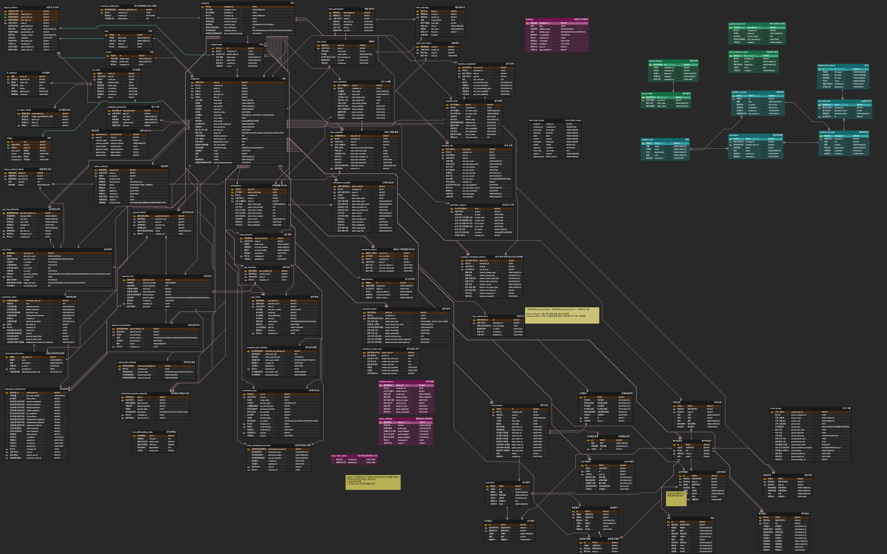
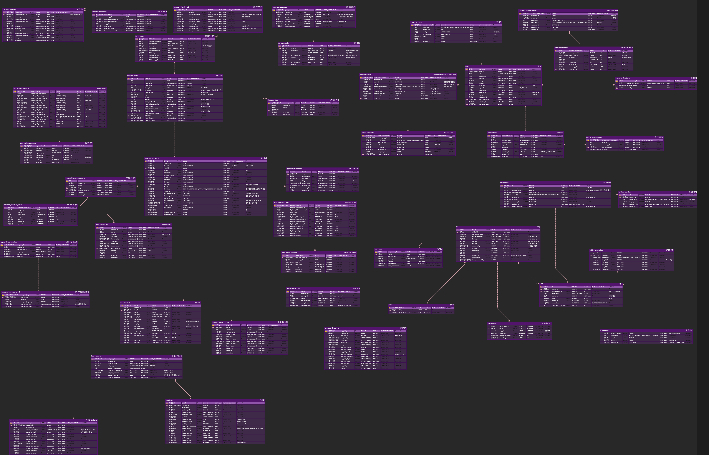

# PeopleCore - 전자결재 시스템

Spring Boot 기반 마이크로서비스 아키텍처로 구현한 전자결재 시스템입니다.
문서 기안부터 결재 완료까지의 전체 결재 프로세스를 지원하며, HR 시스템과 연동하여 조직 기반의 결재 워크플로우를 제공합니다.

---

## 프로젝트 문서

- [WBS 및 요구사항 명세서](https://docs.google.com/spreadsheets/d/1ALYx-2p5l8czzkQxdX7Dp3tdlmTaNh0fP9mfEfIhK14/edit?usp=sharing)
- [기획서](https://docs.google.com/document/d/1LhBwkw5gadTXXApqSiI7-_ngIhpgbRAm/edit?usp=sharing&ouid=113011859077434472718&rtpof=true&sd=true)
- [ERD (ERDCloud)](https://www.erdcloud.com/d/zu3piDR4rivmATs4d)

---

## ERD

<details>
<summary>ERD 전체</summary>


</details>

<details>
<summary>HR / 기타 모듈 ERD</summary>



</details>

<details>
<summary>Collaboration 모듈 ERD (전자결재, 게시판, 캘린더, 알림)</summary>



</details>

---

<details>
<summary><h2>기술 스택</h2></summary>

### Backend
| 분류 | 기술 |
|------|------|
| Language | Java 17 |
| Framework | Spring Boot 3.5.13, Spring Cloud 2025.0.1 |
| ORM / Query | Spring Data JPA, QueryDSL 5.1.0 (Jakarta) |
| Database | MySQL |
| Cache | Redis |
| Message Broker | Apache Kafka, Spring Cloud Stream |
| Search Engine | Elasticsearch (Spring Data Elasticsearch) |
| File Storage | MinIO 8.5.7 (S3 호환 오브젝트 스토리지) |

### Microservice Infrastructure
| 분류 | 기술 |
|------|------|
| API Gateway | Spring Cloud Gateway (WebFlux) |
| Service Discovery | Netflix Eureka (Server / Client) |
| Config Management | Spring Cloud Config Server |
| Circuit Breaker | Resilience4j |
| Event Bus | Spring Cloud Bus (Kafka Binder) |
| Monitoring | Spring Boot Actuator |

### Security / Auth
| 분류 | 기술 |
|------|------|
| JWT | JJWT 0.11.5 |
| Encryption | Spring Security Crypto |
| SMS 인증 | CoolSMS (nurigo) 4.3.0 |

### Build / Utility
| 분류 | 기술 |
|------|------|
| Build Tool | Gradle (멀티모듈) |
| Code Generation | Lombok 1.18.32, MapStruct 1.5.5.Final |

</details>

---

<details>
<summary><h2>서비스 모듈 구성</h2></summary>

```
PeopleCore/
├── api-gateway/            # API 라우팅, JWT 검증, 사용자 헤더 주입
├── eureka-server/          # 서비스 디스커버리
├── config-server/          # 중앙 설정 관리
├── common/                 # 공통 엔티티, 설정, 인터셉터
├── hr-service/             # 인사 관리 (사원, 부서, 직급, 급여, 근태)
├── collaboration-service/  # 전자결재, 게시판, 캘린더, 알림
└── search-service/         # Elasticsearch 기반 통합 검색
```

</details>

---

<details>
<summary><h2>주요 기능</h2></summary>

<details>
<summary><h3>전자결재</h3></summary>

#### 결재 프로세스 전체 흐름

```
┌─────────┐     ┌──────────┐     ┌──────────────────────────────┐     ┌───────────────┐
│ 양식 선택 │ ──→ │ 문서 작성  │ ──→ │         결재 요청 (상신)        │ ──→ │   결재 진행     │
│         │     │          │     │                              │     │               │
│ · 양식 폴더 │     │ · 임시저장  │     │ · 문서번호 자동채번              │     │ · 순차 결재     │
│   계층 탐색 │     │   (DRAFT) │     │   (슬롯+날짜+순번 조합)         │     │   (lineStep)  │
│ · 버전 관리 │     │ · 결재선   │     │ · 위임 자동 처리                │     │ · 승인/반려     │
│ · 작성 권한 │     │   템플릿   │     │   (부재 시 대결자 전환)          │     │ · 회수 (기안자)  │
│   (ALL/   │     │   불러오기  │     │ · 첫 번째 결재자 알림 발송       │     │ · 반려 후 재기안  │
│  DEPT/    │     │ · 첨부파일  │     │   (Kafka 비동기)              │     │               │
│  PERSONAL)│     │ · 긴급문서  │     │ · 자동 분류 규칙 적용            │     │               │
└─────────┘     └──────────┘     └──────────────────────────────┘     └───────┬───────┘
                                                                              │
                                                                              ↓
┌───────────────────────────────────────────────────────────────────────────────────────┐
│                              결재 완료                                                  │
│                                                                                       │
│  · 마지막 결재자 승인 시 문서 상태 자동 전환 (PENDING → APPROVED)                             │
│  · 서명이 포함된 완성 HTML 문서 생성 → MinIO 아카이빙                                        │
│  · 기안자 및 관련자에게 완료 알림 발송                                                       │
│  · 개인 문서함 / 부서 문서함에 자동 분류                                                     │
└───────────────────────────────────────────────────────────────────────────────────────┘
```

#### 문서 상태 전이

```
임시저장(DRAFT) → 결재 요청(PENDING) → 승인(APPROVED) / 반려(REJECTED) / 회수(CANCELED)
                                         ↑
                              반려 후 재기안 ──┘
```

각 상태는 **State Pattern**으로 관리되어, 상태별로 허용되는 동작만 실행 가능합니다.

#### 문서함 시스템

- **개인 문서함** : 사용자가 직접 폴더를 생성하고, 자동 분류 규칙(제목/양식/기안자/부서 조건 AND 결합)을 설정하여 문서를 자동 분류
- **부서 문서함** : 대기함, 수신함, 발신함, 참조함, 열람함으로 구성

</details>

<details>
<summary><h3>공통 테이블 설계</h3></summary>

모듈마다 댓글, 즐겨찾기, 첨부파일 테이블을 개별적으로 만들면 테이블 수가 급증합니다. 이를 방지하기 위해 `entityType + entityId` 복합 키 패턴으로 공통 테이블을 설계하여 여러 모듈(전자결재, 게시판, 캘린더 등)에서 하나의 테이블을 재사용합니다.

| 공통 테이블 | 용도 | 주요 필드 |
|-------------|------|-----------|
| `CommonComment` | 댓글 | `entityType`, `entityId`, `parentCommentId`(대댓글), 작성자 정보 비정규화 |
| `CommonBookmark` | 즐겨찾기 | `entityType`, `entityId`, `empId` (동일 엔티티 중복 방지 UK) |
| `CommonCodeGroup` / `CommonCode` | 코드 그룹 → 코드 | `groupCode`로 그룹 분류, `codeValue`로 코드 값 관리, 정렬 순서 지원 |
| `CommonAttachFile` | 첨부파일 | `entityType`, `entityId`, MinIO 연동 (`storedFileName`, `fileUrl`) |

**설계 원칙**

- **FK 없는 느슨한 결합** : MSA 환경에서 모듈 간 DB 외래키 제약 없이 `entityType + entityId`로 논리적 연결
- **작성자 정보 비정규화** : 댓글/즐겨찾기에 사원명, 부서명, 직급명을 스냅샷으로 저장하여 HR 서비스 호출 없이 조회 가능
- **하나의 테이블로 다수 모듈 지원** : 전자결재 댓글, 게시판 댓글, 캘린더 댓글 등을 `entityType` 값만 다르게 하여 동일 테이블에서 관리

</details>

</details>

---

<details>
<summary><h2>문제 해결 사례</h2></summary>

<details>
<summary><h3>전자결재</h3></summary>

<details>
<summary>1. 동시성 충돌 - 결재자 승인 vs 기안자 회수</summary>

**문제**

결재자가 승인 버튼을 누르는 동시에 기안자가 문서를 회수하면, 두 요청이 동시에 처리되어 데이터 정합성이 깨지는 문제가 발생합니다.

**해결 - JPA 낙관적 락 (Optimistic Lock)**

`ApprovalDocument` 엔티티에 `@Version` 필드를 적용했습니다. JPA가 UPDATE 쿼리 실행 시 `WHERE version = N` 조건을 자동으로 부여하여, 먼저 처리된 요청만 성공하고 뒤늦게 도착한 요청은 `OptimisticLockException`이 발생합니다.

```java
@Version
private Long version;
```

</details>

<details>
<summary>2. 채번 동시성 - 동시 기안 시 중복 번호 발급</summary>

**문제**

여러 사용자가 동시에 문서를 기안하면 같은 순번이 발급되어 문서번호가 중복될 수 있습니다.

**해결 - 비관적 락 + 낙관적 락 + 재시도**

`ApprovalSeqCounter`에 이중 락을 적용했습니다. 채번 시 `PESSIMISTIC_WRITE` 락으로 카운터 행을 선점하고, `@Version`으로 추가 안전장치를 두었습니다. `DataIntegrityViolationException` 발생 시 최대 3회까지 자동 재시도합니다.

```
@Lock(LockModeType.PESSIMISTIC_WRITE)
@Query("SELECT s FROM ApprovalSeqCounter s WHERE ...")
Optional<ApprovalSeqCounter> findWithLock(...);
```

</details>

<details>
<summary>3. 상태 전이 복잡도 - State Pattern 적용</summary>

**문제**

문서 상태(임시저장/진행중/승인/반려/회수)별로 허용되는 동작이 다른데, if-else로 관리하면 상태가 추가될 때마다 분기문이 늘어나 유지보수가 어렵습니다.

**해결 - 상태 패턴 (State Pattern)**

`ApprovalStatus` enum에 각 상태별 State 객체를 내장했습니다. 각 State가 `approve()`, `reject()`, `recall()`, `submit()` 동작의 허용 여부를 스스로 판단하므로, 새로운 상태가 추가되어도 기존 코드를 수정할 필요가 없습니다.

```
ApprovalStatus
├── DRAFT    → DraftState    : submit만 허용
├── PENDING  → PendingState  : approve, reject, recall 허용
├── APPROVED → ApprovedState : 모든 동작 차단
├── REJECTED → RejectedState : submit(재기안)만 허용
└── CANCELED → CanceledState : 모든 동작 차단
```

</details>

<details>
<summary>4. 동적 검색 조건 - QueryDSL 활용</summary>

**문제**

문서함 목록 조회 시 제목, 기안자, 문서번호, 날짜 범위, 양식, 상태 등 다양한 조건이 선택적으로 조합됩니다. 정적 쿼리로는 모든 조합을 대응할 수 없고, 문자열 기반 동적 쿼리는 타입 안전성이 없습니다.

**해결 - QueryDSL + BooleanBuilder**

`ApprovalDocumentCustomRepositoryImpl`에서 `BooleanBuilder`를 활용한 동적 쿼리를 구현했습니다. 입력된 조건만 WHERE절에 추가되고, EXISTS 서브쿼리로 결재선 기반 필터링(대기함, 참조함 등)을 처리합니다.

- 공통 필터를 재사용 가능한 헬퍼 메서드로 분리 (`applyCommonFilters`)
- Content 쿼리와 Count 쿼리를 분리하여 Count 시 불필요한 JOIN 제거
- `CASE + SUM` 집계로 여러 문서함의 건수를 단일 쿼리로 조회 (`countAllBoxes`)
- `fetchJoin`으로 N+1 문제 해결

</details>

<details>
<summary>5. 문서번호 유연성 - Strategy Pattern 적용</summary>

**문제**

회사마다 문서번호 형식이 다릅니다. 어떤 회사는 부서코드를 넣고, 어떤 회사는 양식명을 넣으며, 커스텀 텍스트를 원하는 경우도 있습니다. 하드코딩하면 회사별 요구사항에 대응할 수 없습니다.

**해결 - SlotTypeRegistry + Strategy Pattern**

각 슬롯 타입(`CompanyNameSlot`, `DeptCodeSlot`, `FormCodeSlot`, `CustomSlot` 등)을 독립된 전략 객체로 구현하고, `SlotTypeRegistry`가 런타임에 적절한 슬롯을 선택합니다. 새로운 슬롯 타입이 필요하면 구현체만 추가하면 됩니다.

```
SlotTypeRegistry
├── COMPANY_NAME → CompanyNameSlot
├── DEPT_CODE    → DeptCodeSlot
├── DEPT_NAME    → DeptNameSlot
├── FORM_CODE    → FormCodeSlot
├── FORM_NAME    → FormNameSlot
├── CUSTOM       → CustomSlot
└── NONE         → NoneSlot
```

</details>

<details>
<summary>6. Kafka - 비동기 이벤트 기반 알림 및 캐시 무효화</summary>

**도입 배경**

결재 요청, 승인, 반려 시마다 관련자에게 알림을 보내야 합니다. 동기 방식으로 처리하면 알림 발송 실패가 결재 트랜잭션 자체를 실패시킬 수 있고, 응답 시간도 길어집니다. 또한 HR 서비스에서 부서 정보가 변경되면 Collaboration 서비스의 캐시를 즉시 무효화해야 합니다.

**적용 방식**

| 토픽 | 발행자 | 소비자 | 목적 |
|------|--------|--------|------|
| `alarm-event` | Collaboration (결재/댓글) | Collaboration (AlarmConsumer) | 결재 이벤트 발생 시 실시간 알림 생성 및 푸시 |
| `hr-dept-updated` | HR Service (부서 변경 시) | Collaboration (HrEventConsumer) | 부서 정보 변경 시 Redis 캐시 무효화 |

- 결재 서비스와 알림 서비스 간 느슨한 결합으로, 알림 실패가 결재 로직에 영향을 주지 않음
- 서비스 간 이벤트 전파로 데이터 정합성을 비동기적으로 유지

</details>

<details>
<summary>7. Redis - 캐시 및 인증 토큰 관리</summary>

**도입 배경**

Collaboration 서비스에서 결재 문서 조회 시 기안자의 부서명, 직급명 등 HR 데이터가 필요합니다. 매 요청마다 HR 서비스를 호출하면 서비스 간 의존도가 높아지고 응답 시간이 증가합니다. 또한 JWT Refresh Token과 SMS 인증 코드처럼 TTL이 필요한 임시 데이터를 관리할 저장소가 필요합니다.

**적용 방식**

| 인스턴스 | DB | 키 패턴 | TTL | 용도 |
|----------|-----|---------|-----|------|
| Redis 1 (6379) | DB 0 | `RT:{empId}` | 7일 | JWT Refresh Token 저장 |
| Redis 1 (6379) | DB 1 | `SMS_CODE:{phone}` | 3분 | SMS 인증 코드 |
| | | `SMS_COOLDOWN:{phone}` | 60초 | 재전송 쿨다운 |
| | | `SMS_FAIL:{phone}` | 10분 | 실패 횟수 추적 (5회 초과 시 차단) |
| Redis 2 (6380) | DB 0 | `hr:dept:{deptId}` | 1시간 | 부서 정보 캐시 |
| | | `hr:company:{companyId}` | 1시간 | 회사 정보 캐시 |
| | | `hr:emp:{empId}` | 1시간 | 사원 정보 캐시 |

- **Cache-Aside 패턴** : 캐시 미스 시 HR 서비스 호출 후 결과를 캐시에 저장
- **Kafka 연동 캐시 무효화** : `hr-dept-updated` 이벤트 수신 시 해당 부서 캐시 즉시 삭제
- **SMS 보안** : 쿨다운, 실패 횟수 제한, 차단 기능으로 SMS 폭탄 공격 방지

</details>

</details>

</details>
